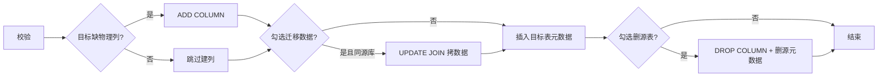
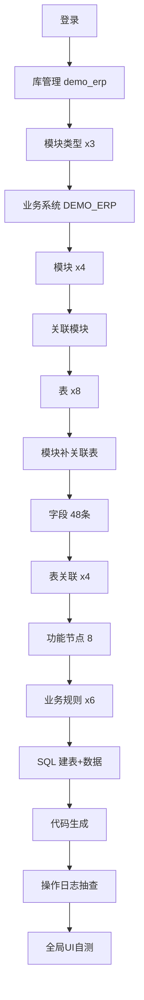

# 元数据管理系统 — 使用说明书（操作说明 + 逐步清单）

> 本文档描述平台各菜单、字段、按钮含义，以及从零配置示例业务系统 `DEMO_ERP` 的步骤与速查附录。与界面不一致时，以**当前仓库代码 + 本文**为准并回头改文档。

> **怎么用**  
> 
> | 目的 | 阅读顺序 |
> | ---- | -------- |
> | 从零搭 `DEMO_ERP` | [第 0 章](#toc-0) 通读 → [第 1～16 章](#toc-1) 逐步点界面 → [自检清单](#toc-checklist) |
> | **查某个按钮/字段含义** | 第 0 章对应小节（0.5～0.16）+ [附录 A 路由](#toc-appendix-a) |
> | **查校验规则 / 下拉选项怎么配** | [§9 字段清单](#toc-9) + [附录 G validateRule 完整参考](#toc-appendix-g) |
> | **状态 IN 与「枚举值验证」示例有何区别** | [附录 G §2.3～§3](#toc-appendix-g) + [0.10 状态码](#toc-0-10) |
> | **查预览 / Mock / ZIP 差异** | [附录 C 业务系统预览](#toc-appendix-c) + [附录 I Mock 规则](#toc-appendix-i) + [附录 J 节点与生成文件](#toc-appendix-j) |
> | **未保存提示 / 编码自动去空格** | [0.19 录入体验](#toc-0-19) |
> | **字段建错表、迁到另一张表** | [0.10 迁移到其他表](#toc-0-10-migrate) |
> | **排错** | [附录 F](#toc-appendix-f) |
> 
> - **[第 0 章](#toc-0)**：**操作说明（完整版）** — 每个菜单、按钮、列表列、弹窗字段；不省略界面文案。  
> - **[第 1～16 章](#toc-1)**：**逐步操作清单** — 按顺序在系统里点哪里、填什么（从零搭一套 `DEMO_ERP`）；**不是故事**，是可执行的点击步骤表 + 示例值表格。  
> - **[附录 A～J](#toc-appendix-a)**：路由、生成标签 API、预览、规则 JSON、示例总览、排错、产品边界、Mock、节点产物等**速查表**。  
> 
> **约定（全文统一）**  
> 
> | 项 | 值 |
> | --- | --- |
> | 业务系统编码 | `DEMO_ERP` |
> | 物理库名 | `demo_erp` |
> | Java 包名 | `com.demo.erp` |
> | 登录账号 | 用户名 `admin`，密码 `123456`（若已改密以实际为准） |
> | 前端部署前缀 | `/metadata-system/`（如 `/metadata-system/login`） |
> | 主键字段编码 | 恒为 **`ID`**（不是 `MC_F_ID` 这类业务 fieldCode） |

### 已有数据库升级（开始按清单操作前）

若库由**旧版** `init.sql` 初始化、尚未包含下列列，请在 MySQL 中执行仓库内脚本（无则跳过；以执行报错为准）：

| 脚本                                              | 作用                         |
| ----------------------------------------------- | -------------------------- |
| `database/alter_business_system_is_enabled.sql` | 业务系统增加 `is_enabled`（启用/停用） |
| `database/alter_metadata_field_in_form.sql`     | 字段增加 `in_form`（是否参与表单录入）   |

**全新**按当前仓库 `database/init.sql` 建库可跳过上述脚本。

### 启用链与界面（了解即可，不影响逐步点击）

元数据按 **业务系统 → 物理库登记 → 表 → 字段** 逐级启用；**默认列表/下拉**只出现「整条链均为启用」的对象（便于业务侧选表、选库）。**各管理页**在加载列表时已带「含停用」参数，故按清单操作时**照常点界面即可**，无需手拼 `includeDisabled` 等查询参数。

---

## 目录

> 目录使用固定锚点 `toc-*`（文内已插入），在 VS Code / Cursor / GitHub 预览中均可点击跳转。

**操作说明（建议先通读）**

- [第 0 章 总览](#toc-0)  
  - [0.0 环境与部署前置](#toc-0-0)  
  - [0.1 系统定位与元数据层级](#toc-0-1)  
  - [0.2 登录页与欢迎页](#toc-0-2)  
  - [0.3 主框架](#toc-0-3)  
  - [0.4 启用链与下拉可见性](#toc-0-4)  
  - [0.5 库管理](#toc-0-5)  
  - [0.6 业务系统管理](#toc-0-6)  
  - [0.7 模块类型管理](#toc-0-7)  
  - [0.8 模块管理](#toc-0-8)  
  - [0.9 表管理](#toc-0-9)  
  - [0.10 字段管理](#toc-0-10)  
  - [0.11 表关联](#toc-0-11)  
  - [0.12 功能节点](#toc-0-12)  
  - [0.13 业务规则](#toc-0-13)  
  - [0.14 SQL 执行](#toc-0-14)  
  - [0.15 代码生成](#toc-0-15)  
  - [0.16 操作日志](#toc-0-16)  
  - [0.17 推荐搭建顺序](#toc-0-17)  
  - [0.18 编码对照表](#toc-0-18)  
  - [0.19 录入体验（未保存提示与编码规范化）](#toc-0-19)  
  - [附录 A 路由对照](#toc-appendix-a)  
  - [附录 B 代码生成标签](#toc-appendix-b)  
  - [附录 C 业务系统预览](#toc-appendix-c)  
  - [附录 D 校验规则原文](#toc-appendix-d)  
  - [附录 E 示例数据总览](#toc-appendix-e)  
  - [附录 F 排错](#toc-appendix-f)  
  - [附录 G validateRule 完整参考](#toc-appendix-g)  
  - [附录 H 产品边界与交付范围](#toc-appendix-h)  
  - [附录 I Mock 示例数据生成规则](#toc-appendix-i)  
  - [附录 J 功能节点类型与生成产物](#toc-appendix-j)

**逐步操作清单（第 1～16 章，按顺序执行）**

1. [登录与欢迎](#toc-1)
2. [库管理](#toc-2)
3. [模块类型管理](#toc-3)
4. [业务系统管理](#toc-4)
5. [模块管理](#toc-5)
6. [业务系统关联模块](#toc-6)
7. [表管理](#toc-7)
8. [模块管理补全关联表](#toc-8)
9. [字段管理](#toc-9)（含「参与表单录入」）
10. [表关联管理](#toc-10)
11. [功能节点管理](#toc-11)
12. [业务规则管理](#toc-12)
13. [SQL 执行](#toc-13)
14. [代码生成](#toc-14)
15. [操作日志](#toc-15)
16. [侧栏与标签页](#toc-16)
17. [自检清单](#toc-checklist)

---

<a id="toc-0"></a>

## 0. 系统操作说明（完整版）

本章按**界面真实文案**逐项说明，不省略按钮与列。清单里要填的示例数据见第 1～16 章各节表格。

<a id="toc-0-1"></a>

### 0.1 系统定位与元数据层级

本系统是 **通用元数据管理平台**：在 MySQL 上登记业务库、表、字段及模块/节点/规则，并据此 **生成 Java + Vue 工程代码**、执行 SQL、预览列表/表单。

**层级关系（由顶向下）**：

| 层级   | 菜单位置   | 作用                                             |
| ---- | ------ | ---------------------------------------------- |
| 物理库  | 库管理    | 登记 MySQL 库名、字符集；可选保存时/手动在服务器 `CREATE DATABASE` |
| 业务系统 | 业务系统管理 | 一个业务产品一条：编码、包名、**默认物理库**、启用/默认                 |
| 模块类型 | 模块类型管理 | 定义模块「默认功能节点」模板（列表页、表单页等）                       |
| 模块   | 模块管理   | 业务域划分：关联业务系统、类型、路由/组件、**关联表**                  |
| 表    | 表管理    | 逻辑表元数据：编码、主键策略、业务系统、可选覆盖物理库名                   |
| 字段   | 字段管理   | 列元数据：类型、表单组件、校验 JSON、**参与表单录入**                |
| 表关联  | 表关联    | 主从表关系；可选在库上建外键                                 |
| 功能节点 | 功能节点   | 页面级菜单：节点类型、关联表、跳转、路由                           |
| 业务规则 | 业务规则   | 按模块挂 JSON 规则（校验/搜索/显示/流程/报表/批量）                |

**侧栏菜单顺序（与 `Layout.vue` 一致）**：库管理 → 业务系统管理 → 模块类型管理 → 模块管理 → 表管理 → 字段管理 → 功能节点 → 表关联 → 业务规则 → 操作日志 → 代码生成 → SQL 执行。

**数据流（一句话）**：

```text
物理库登记 → 业务系统(包名+默认库) → 模块/模块类型 → 表+字段(类型/组件/validateRule)
    → 表关联 → 功能节点(页面类型+路由) → 业务规则(JSON)
        → 代码生成 / ZIP 下载 / 业务系统预览(Mock)
```

> **欢迎页**不在侧栏：登录后默认进入 `/welcome`，仅文案「欢迎使用…请从左侧菜单选择功能」。

---

<a id="toc-0-0"></a>

### 0.0 环境与部署前置（动手前必读）

| 项       | 说明                                                        |
| ------- | --------------------------------------------------------- |
| 后端      | Spring Boot，默认提供 REST API（路径前缀一般为 `/metadata-system/api`） |
| 前端      | Vue 3 + Element Plus，构建后挂载在 **`/metadata-system/`** 下     |
| 元数据库    | 平台自身元数据通常落在 `metadata_db`（业务系统下拉里可见，**不要**把演示业务表建在元数据库里）  |
| 业务库     | 本清单使用 `demo_erp`，须先在 **库管理** 登记                           |
| 登录账号    | 默认 `admin` / `123456`（`database/init.sql` 初始化；若已改密以实际为准）  |
| 浏览器     | 建议 Chrome/Edge；需允许剪贴板（代码生成「复制」）                           |
| Session | 登录信息在 `sessionStorage` 的 `admin` 键；退出或关标签不会自动续期以外的机制      |

**数据库升级**：旧库缺列时执行文首表格中的 `alter_*.sql`；全新安装直接跑当前 `init.sql` 即可。

---

<a id="toc-0-2"></a>

### 0.2 登录页与欢迎页

#### 登录页 `/login`

| 元素     | 类型  | 校验/行为                | 说明                                                                           |
| ------ | --- | -------------------- | ---------------------------------------------------------------------------- |
| 用户名    | 输入框 | 必填，`blur` 触发         | 占位「请输入用户名」；默认 `admin`                                                        |
| 密码     | 密码框 | 必填；可 `show-password` | 占位「请输入密码」；**Enter** 触发登录                                                     |
| **登录** | 主按钮 | 表单通过后请求 API          | 成功：`sessionStorage.setItem('admin', …)` → `router.push('/')` → 欢迎页；失败：顶部错误提示 |
| 页脚     | 文本  | —                    | `© 2025 Metadata Management System`                                          |

**失败常见原因**：密码错误、后端未启动、跨域/代理未配置。

#### 欢迎页 `/welcome`

| 元素  | 说明               |
| --- | ---------------- |
| 标题  | 「欢迎使用通用元数据管理系统」  |
| 副文案 | 「请从左侧菜单选择功能进行操作」 |
| 按钮  | **无**            |

从侧栏进入任意功能后，本页不再自动出现，除非关闭全部标签或访问 `/welcome`。

---

<a id="toc-0-3"></a>

### 0.3 主框架：侧栏、标签、用户菜单

#### 左侧

| 元素        | 说明                                  |
| --------- | ----------------------------------- |
| Logo      | 展开显示「元数据管理」，收起显示「元」                 |
| 菜单项       | 共 12 项，见 0.1；点击 **路由跳转** 并新增/激活顶部标签 |
| **底部折叠钮** | 侧栏 200px ↔ 64px；仅图标模式               |

#### 顶部右侧用户区

| 菜单项      | 说明                                         |
| -------- | ------------------------------------------ |
| **修改密码** | 弹窗：原密码、新密码、确认密码（须一致）→ **确定** 调接口；**取消** 关闭 |
| **退出登录** | 二次确认 → 清 session → 回登录页                    |

#### 标签页（Tags View）

| 操作       | 说明                                      |
| -------- | --------------------------------------- |
| 左键切换     | 激活标签并切换路由                               |
| 标签 ×     | **关闭**该页；若关的是当前页则切到相邻标签，全无则回欢迎页         |
| **拖拽**   | 可调整标签顺序                                 |
| **右键标签** | **关闭** / **关闭其他** / **全部关闭**（全部关闭后回欢迎页） |

主内容区使用 `keep-alive` 缓存已打开页面组件状态（按 Vue 组件 `name` 缓存，关闭标签会从缓存移除）。

#### 未保存修改提示（弹窗与 SQL 页）

| 场景 | 行为 |
| ---- | ---- |
| **表 / 字段 / 模块 / 业务系统 / 库 / 关联 / 规则 / 模块类型** 等「新增/编辑」弹窗 | 打开时拍表单快照；点 **取消**、右上角 **×**、遮罩或 **Esc** 关闭时，若内容有改动会提示 **「未保存的修改」** → **继续编辑** / **放弃修改**；**确定** 保存成功后不再提示 |
| **表管理 · 批量分配业务系统** 弹窗 | 同上 |
| **SQL 执行** 页 Monaco 编辑器 | 离开本菜单或刷新浏览器前，若编辑器内容与上次「清空/导入/打开页」基准不一致，会提示是否离开 |

未改动的弹窗直接关闭，不会误弹。详见 [0.19](#toc-0-19)。

#### 修改密码弹窗（逐项）

| 字段     | 校验                             |
| ------ | ------------------------------ |
| 原密码    | 必填                             |
| 新密码    | 必填                             |
| 确认密码   | 必填；须与新密码一致                     |
| **取消** | 关闭弹窗，不保存                       |
| **确定** | 调 `changePassword` API；成功提示并关闭 |

弹窗属性：`close-on-click-modal="false"`、`close-on-press-escape="false"`（防误关）。

#### 退出登录

1. 下拉选「退出登录」  
2. 确认框「确定要退出登录吗？」→ **确定**  
3. 调 `logout`，清除 `sessionStorage.admin`，跳转 `/login`

---

<a id="toc-0-4"></a>

### 0.4 启用链与下拉可见性

| 场景                 | 行为                                            |
| ------------------ | --------------------------------------------- |
| 业务系统 `isEnabled=0` | 代码生成选表、模块关联表、字段表下拉等**不展示**该系统下对象              |
| 物理库 `isEnabled=0`  | 业务系统「默认物理库」下拉不出现该库（库管理列表仍可见）                  |
| 表 `isEnabled=0`    | 模块「关联表」、代码生成「选择表」等不出现；**表管理/字段管理列表仍可见**       |
| 字段 `isEnabled=0`   | 生成代码时可能忽略该字段；字段列表仍可见                          |
| 管理页列表              | 多数接口带 `includeDisabled: true`，故配置页能看到停用项并重新启用 |

**清单建议**：按清单做启用/禁用验证时，区分「配置列表仍见」与「业务下拉不见」。

---

<a id="toc-0-5"></a>

### 0.5 库管理（详版）

**路由**：`/physical-database`  
**页面作用**：维护 **MySQL 物理库登记**，与业务系统「默认物理库」、表级 `databaseName`、SQL 执行「目标数据库」对齐。  
**列表加载**：`getPhysicalDatabaseList({ includeDisabled: true })`，停用库仍显示。

#### 页头

| 按钮      | 说明                                |
| ------- | --------------------------------- |
| **新增库** | `dialogTitle=新增库`，`resetForm` 后打开 |

#### 提示条（蓝色 info Alert，不可关闭）

原文要点：维护要在数据库里使用的库名；打开「保存时建库」则保存时尝试 `CREATE DATABASE`（已有则跳过）；删除会清理元数据引用，可选同时 `DROP DATABASE`（不可恢复）。

#### 列表列（`border` 表格，`v-loading`）

| 列     | 宽度约       | 说明                        |
| ----- | --------- | ------------------------- |
| 库名    | 160       | `catalogName`             |
| 展示名称  | 140       | tooltip                   |
| 说明    | auto      | tooltip                   |
| 字符集   | 110       | 如 utf8mb4                 |
| 排序规则  | 160       | 如 utf8mb4_unicode_ci      |
| 保存时建库 | 110       | Tag 开/关（`syncToInstance`） |
| 状态    | 90        | Tag 启用/停用                 |
| 创建时间  | 170       | —                         |
| 操作    | 260 fixed | 三按钮                       |

#### 行操作（逐步）

| 按钮         | 用户步骤 | 系统行为                                                                   |
| ---------- | ---- | ---------------------------------------------------------------------- |
| **编辑**     | 点编辑  | 回填行数据；`catalogName` **disabled**；`normalizeCharsetCollation` 修正非法组合    |
| **去服务器建库** | 点按钮  | `syncPhysicalDatabase(id)`；成功 toast「已在服务器上处理完成（没有则创建）」                 |
| **删除**     | 点删除  | ①「确定要删除库「xxx」吗？会清理元数据…」②「是否在服务器上同时删除…」— **同时删** 需第三次确认；**仅删配置** 点取消第二次 |

#### 新增/编辑弹窗（width 560px）

| 字段     | prop           | 必填  | 说明                                |
| ------ | -------------- | --- | --------------------------------- |
| 库名     | catalogName    | ✓   | placeholder：与数据库一致；**仅字母数字下划线等**  |
| 展示名称   | displayName    | —   | clearable                         |
| 说明     | description    | —   | textarea 3 行                      |
| 字符集    | charsetName    | —   | 默认 utf8mb4；`@change` 重置 collation |
| 排序规则   | collationName  | —   | 见下表                               |
| 保存时建库  | syncToInstance | —   | Switch 1/0；灰字说明                   |
| 启用     | isEnabled      | —   | Switch 1/0                        |
| **取消** | —              | —   | 关弹窗                               |
| **确定** | —              | —   | `submitting` loading；add 或 update |

**字符集 → 可选排序规则**：

| charsetName | collation 示例                                                 |
| ----------- | ------------------------------------------------------------ |
| utf8mb4     | utf8mb4_unicode_ci（推荐）、utf8mb4_general_ci、utf8mb4_0900_ai_ci |
| utf8        | utf8_unicode_ci、utf8_general_ci                              |
| latin1      | latin1_swedish_ci、latin1_general_ci                          |

---

<a id="toc-0-6"></a>

### 0.6 业务系统管理（详版）

**路由**：`/business-system`  
**作用**：定义业务产品边界、**包名**（代码生成只读）、**默认物理库**、与模块的关联。一个部署可有多个业务系统，**默认**的一条会在未指定时优先。

#### 页头按钮

| 按钮         | 启用条件  | 说明             |
| ---------- | ----- | -------------- |
| **批量删除**   | 勾选 ≥1 | 确认后批量删（清单中可跳过） |
| **新增业务系统** | 始终    | 打开新增弹窗         |

#### 搜索

| 字段     | 说明                                      |
| ------ | --------------------------------------- |
| 业务系统名称 | `clearable`；**前端** `includes` 过滤，不调分页接口 |

#### 列表列（逐列）

| 列           | 说明                          |
| ----------- | --------------------------- |
| 勾选          | 批量删除                        |
| 业务编码        | `businessCode`，如 `DEMO_ERP` |
| 业务系统名称      | 界面展示名                       |
| 包名          | Java 根包，生成器只读回填             |
| 默认物理库       | 空显示「—」                      |
| 描述          | 溢出省略                        |
| 是否默认        | Tag 是/否                     |
| 启用          | Tag 是/否（`isEnabled`）        |
| 创建时间 / 更新时间 | `dayjs` 格式化日期               |
| 操作          | 四个按钮                        |

#### 行操作

| 按钮       | 说明                                 |
| -------- | ---------------------------------- |
| **编辑**   | 无「业务编码」表单项                         |
| **设为默认** | `isDefault===1` 时按钮 **disabled**   |
| **关联模块** | 打开关联弹窗；`getAssociatedModules` 回显已选 |
| **删除**   | 确认后删除（清单中可跳过）                      |

#### 新增/编辑弹窗

| 字段              | 新增         | 编辑  | 说明                                                                                      |
| --------------- | ---------- | --- | --------------------------------------------------------------------------------------- |
| 业务编码            | ✓          | ✗   | placeholder 示例 DEFAULT / PET_MANAGE                                                     |
| 业务系统名称          | ✓          | ✓   | 必填                                                                                      |
| 包名              | ✓          | ✓   | 如 `com.demo.erp`                                                                        |
| 默认物理库           | ✓          | ✓   | 下拉：`metadata_db（元数据）` + 启用物理库；`filterable` + `allow-create`；**必选**                      |
| 同步              | ✗          | ✓   | 仅编辑；勾选后：`fillPhysicalCatalog` 写默认库并回补表级空库名 + `ensureMissingPhysicalTables` 建缺表；**均不建库** |
| 描述              | 多行         | 多行  | —                                                                                       |
| 启用              | Switch 1/0 | 同左  | 停用后下游下拉不见                                                                               |
| 是否默认            | Switch 1/0 | 同左  | 可多系统，通常一个默认                                                                             |
| **取消** / **确定** | —          | —   | 确定带 loading                                                                             |

**同步区块要点**：保存成功后先写业务系统默认物理库元数据、回补表级空 `databaseName`（不覆盖已填），再在**已存在**的物理库中为缺表建物理表；不执行 `CREATE DATABASE`（建库仅「库管理」保存时建库/同步）。物理表已存在则跳过。

#### 关联模块弹窗

| 元素       | 说明                                                                                                |
| -------- | ------------------------------------------------------------------------------------------------- |
| 业务系统名称   | **只读** input                                                                                      |
| 模块多选     | `el-select multiple filterable`；`label=moduleName`，`value-key=moduleCode`；选项来自 `getModuleList` 全量 |
| **取消**   | 关弹窗                                                                                               |
| **保存关联** | `associateModulesToBusinessSystem`；记操作日志类型 **关联**                                                 |

#### 分页

`layout="total, sizes, prev, pager, next, jumper"`；`page-sizes` 10/20/50/100。

---

<a id="toc-0-7"></a>

### 0.7 模块类型管理（详版）

**路由**：`/module-type`  
**作用**：为模块分类，并预设 **默认节点类型**（「重建功能节点」会按此生成节点骨架）。  
**不再**在应用启动或 `init.sql` 中自动写入默认类型；列表上方有 **说明区**（参考类型模板 + 功能节点用途），需点「新增类型」或「按此模板新增」自行入库。

#### 页面说明区（列表上方）

| 区块           | 内容                                                  |
| ------------ | --------------------------------------------------- |
| 顶部提示         | `el-alert`：说明类型与默认节点的作用、需手动新增                       |
| **参考类型模板**   | 折叠面板：4 类示例（数据管理型、流程审批型等）及建议节点组合；每类可 **按此模板新增** 预填弹窗 |
| **功能节点类型说明** | 折叠面板：各 `LIST_PAGE` 等节点在重建/生成时的典型用途                  |

#### 页头按钮

| 按钮       | disabled 条件 |
| -------- | ----------- |
| **批量删除** | 未勾选         |
| **新增类型** | 永不          |

批量删除有确认框，成功后清空勾选并刷新列表。

#### 搜索（变更即 `loadData`，current=1）

| 字段   | 绑定                    | 说明  |
| ---- | --------------------- | --- |
| 类型编码 | `searchForm.typeCode` | 模糊  |
| 类型名称 | `searchForm.typeName` | 模糊  |

#### 列表列

| 列    | 说明                                   |
| ---- | ------------------------------------ |
| 勾选   | 批量删除                                 |
| 类型编码 | `typeCode`，如 `MASTER_DATA`           |
| 类型名称 | `typeName`，界面展示用                     |
| 默认节点 | `formatter` 把 `LIST_PAGE` 等转成中文，逗号连接 |
| 描述   | 溢出省略                                 |
| 操作   | **编辑** / **删除**（删除有确认）               |

#### 分页

`layout="total, sizes, prev, pager, next, jumper"`；`page-sizes` 10/20/50/100；默认每页 10 条。列表接口传 `current`、`size` 时返回 `{ records, total }`；**模块管理**下拉仍调用无分页参数的 `GET /moduleType/list` 取全量。

#### 弹窗

`label-width="120px"`；`width="560px"`；表单项带 `prop` 并绑定 `:rules`，必填项标签前显示红色 `*`（Element Plus 默认样式）。

| 字段     | 新增                                                          | 编辑                | 必填（红*） | 校验                                            |
| ------ | ----------------------------------------------------------- | ----------------- | ------ | --------------------------------------------- |
| 类型编码   | 可编辑；placeholder 如 `MASTER_DATA`                             | **disabled**      | ✓      | 非空；须匹配 `^[A-Z][A-Z0-9_]*$`（大写字母开头，仅字母/数字/下划线） |
| 类型名称   | ✓                                                           | ✓                 | ✓      | 非空                                            |
| 默认节点   | 多选下拉                                                        | 同左                | ✓      | 至少选 1 项；选项见 [0.18](#toc-0-18)                 |
| 描述     | textarea 3 行                                                | 同左                | —      | 可选                                            |
| **取消** | 关弹窗                                                         |                   |        |                                               |
| **保存** | `formRef.validate` 通过后 `addModuleType` / `updateModuleType` | 成功关弹窗并 `loadData` |        |                                               |

弹窗 `@close` 时 `formRef.resetFields()`。校验未通过时表单项下方红色提示，不发起保存请求。

**业务说明**：类型编码、名称与后端必填一致；默认节点虽库表可空，但「重建功能节点」依赖 `defaultNodes`，未配置时重建会失败，故前端列为必填。描述仅作说明，可留空。

---

<a id="toc-0-8"></a>

### 0.8 模块管理（详版）

**路由**：`/module`  
**作用**：业务子系统；挂 **业务系统、类型、表、路由**；可批量启停。`status` 字段：1=启用，0=禁用（与表 `isEnabled` 命名不同）。

#### 页头按钮

| 按钮       | disabled 条件  |
| -------- | ------------ |
| **批量删除** | 未勾选          |
| **批量禁用** | 未勾选，或所选全部已禁用 |
| **批量启用** | 未勾选，或所选全部已启用 |
| **新增模块** | 永不           |

批量操作均有确认框，成功后清空勾选。

#### 搜索（变更即 `loadData`，current=1）

| 字段   | 绑定                          | 说明            |
| ---- | --------------------------- | ------------- |
| 模块名称 | `searchForm.moduleName`     | 模糊            |
| 模块类型 | `moduleType` = **typeCode** | 下拉显示 typeName |
| 业务系统 | `businessCode`              | —             |
| 状态   | `1` / `0`                   | 启用/禁用         |

#### 列表列

| 列    | 宽度约       | 说明                   |
| ---- | --------- | -------------------- |
| 勾选   | 55        | —                    |
| 模块编码 | 150       | —                    |
| 模块名称 | auto      | —                    |
| 业务系统 | 150       | Tag，空为「未关联」          |
| 模块类型 | 150       | 显示 **编码** 非中文        |
| 描述   | auto      | tooltip              |
| 关联表  | 150       | 多个小 Tag，值为 tableCode |
| 图标   | 120       | 图标+英文 icon 名         |
| 路由路径 | 150       | 如 `/mdm`             |
| 组件路径 | 200       | 如 `views/mdm`        |
| 状态   | 100       | 启用/禁用 Tag            |
| 操作   | 220 fixed | 四个按钮                 |

#### 行操作

| 按钮              | 说明                           |
| --------------- | ---------------------------- |
| **编辑**          | 异步拉 `getTablesByModule` 填关联表 |
| **禁用** / **启用** | 确认后 `updateModuleStatus`     |
| **重建功能节点**      | 见 [附录 D](#toc-appendix-d)    |
| **删除**          | 确认                           |

#### 新增/编辑弹窗（label-width 100px）

| 字段              | 说明                                                            |
| --------------- | ------------------------------------------------------------- |
| 模块编码            | 仅新增；placeholder `MODULE_001`                                  |
| 模块名称            | 必填                                                            |
| 模块类型            | 必填；选项 `typeName`，值 `typeCode`                                 |
| 业务系统            | `@change` → `loadTables(businessCode)`，只加载 **isEnabled=1** 的表 |
| 描述              | textarea 3 行                                                  |
| 关联表             | multiple；绿色提示「可后续再关联」                                         |
| 排序号             | `el-input-number` min=1；**新增默认**为当前列表 max(sort)+1             |
| 图标              | 只读 input + **选择图标**                                           |
| 路由路径            | 须匹配路径正则                                                       |
| 组件路径            | 如 `views/student`                                             |
| **取消** / **确定** | validate 后 add/update                                         |

#### 图标选择器（IconSelector）

| 功能     | 说明                     |
| ------ | ---------------------- |
| 搜索     | 按图标英文名过滤               |
| Tab    | 分类（Element Plus Icons） |
| 点击项    | 高亮选中                   |
| **确定** | 写回 `form.icon`         |
| **取消** | 不关父弹窗仅关图标窗             |

---

<a id="toc-0-9"></a>

### 0.9 表管理（详版）

**路由**：`/table`  
**作用**：维护**逻辑表**元数据（本页弹窗**不含字段**）；**新增表**保存时会自动补 1 条主键字段；**仅当能解析出目标物理库**时才在业务库执行 `CREATE TABLE`（通常只有主键一列），其余列在「字段管理」维护。字段保存会 `ALTER TABLE`；删表会 **DROP 物理表** 并级联删字段元数据。

#### 页头按钮（左→右）

| 按钮           | 启用条件     | 确认框        | 效果            |
| ------------ | -------- | ---------- | ------------- |
| **批量删除**     | 至少勾选 1 行 | 是，提示字段一并删除 | 批量删元数据 + 物理表  |
| **批量禁用**     | 勾选且含启用行  | 是          | `isEnabled=0` |
| **批量启用**     | 勾选且含禁用行  | 是          | `isEnabled=1` |
| **批量分配业务系统** | 至少勾选 1 行 | 弹窗选系统      | 见下「分配规则」      |
| **新增表**      | 始终       | —          | 打开新增弹窗        |

#### 搜索区

| 控件            | 行为                                                      |
| ------------- | ------------------------------------------------------- |
| 表名称           | `@input` 触发搜索，前端过滤/刷新列表（`pagination.current=1`）         |
| 业务系统          | 下拉 `clearable`，变更触发 `loadData`                          |
| **补齐缺失物理表**   | 未选业务系统时按钮逻辑上应先提示；确认文案说明「无字段则加主键、已有表跳过」；返回 `新建/跳过/失败` 计数 |
| **从物理库导入元数据** | 扫描业务系统**默认物理库**，把未登记的表+字段导入；适用于先在 SQL 页建表的后补场景          |

列表请求带 `includeDisabled: true`，故停用表仍可见。

#### 列表列（逐列）

| 列    | 字段             | 展示              |
| ---- | -------------- | --------------- |
| 勾选   | —              | 批量操作            |
| 表编码  | `tableCode`    | 文本              |
| 表名称  | `tableName`    | 文本              |
| 业务系统 | `businessCode` | Tag；空显示「未关联」    |
| 物理库  | `databaseName` | 空则用业务系统默认库      |
| 主键策略 | `pkStrategy`   | `AUTO` / `UUID` |
| 描述   | `description`  | 溢出省略            |
| 状态   | `isEnabled`    | 绿「启用」/ 红「禁用」    |
| 操作   | —              | 见行操作            |

#### 行操作

| 按钮              | 说明                                                      |
| --------------- | ------------------------------------------------------- |
| **编辑**          | 打开编辑弹窗；**主键策略不可改**——若在下拉改了会提示「主键生成策略不允许修改，请删除表后重新创建」并还原 |
| **禁用** / **启用** | 二次确认后 `updateTable` 整条记录                                |
| **删除**          | 确认「关联字段也会被删除」→ 删元数据并尝试 `DROP TABLE`                     |

#### 新增/编辑弹窗

| 字段              | 新增  | 编辑       | 校验                                 |
| --------------- | --- | -------- | ---------------------------------- |
| 表编码             | 显示  | 隐藏（用行数据） | 必填                                 |
| 表名称             | ✓   | ✓        | 必填                                 |
| 主键策略            | ✓   | ✓（不可改值）  | 必填                                 |
| 业务系统            | ✓   | ✓        | **非必填**；可留空先登记，见下「新增时不选业务系统」     |
| 物理库名            | ✓   | ✓        | 下拉选库管理已登记库；可空=业务系统默认               |
| 描述              | 多行  | 多行       | —                                  |
| **取消** / **确定** | —   | —        | **无字段表单项**；见下成功提示                    |

弹窗顶部说明（新增时）：本步只登记表；业务系统可留空、稍后批量分配；未指定业务系统/物理库时仅登记元数据。

#### 新增表：业务系统 / 物理库与建表时机

| 保存时填写情况 | 元数据 | 物理 `CREATE TABLE` |
| ------------ | ------ | ------------------- |
| **业务系统 + 物理库**（或仅业务系统且其有默认库） | ✓ | ✓（仅主键列） |
| **都不填** | ✓（`business_code` 为空，列表显示「未关联」） | **不执行** |
| 只填 **物理库名**、不填业务系统 | ✓ | ✓（用所填库） |

成功后提示分两种：**已建物理表** → 提示去字段管理补列；**仅元数据** → 提示先批量分配业务系统，再在搜索区选该系统后点 **「补齐缺失物理表」**。

表编码、物理库名在失焦/提交时会 **去首尾空格、中间空格转下划线**（表编码并转大写），见 [0.19](#toc-0-19)。

#### 批量分配业务系统规则

- 允许：业务系统列为**空**、或为 **`DEFAULT`**、或与目标编码**相同**。  
- 拒绝：已挂在**其它具体业务编码**的表（列表提示最多 5 个表名）。  
- 提交：`tableCodes[]` + `businessCode`。

#### 分页

`total, sizes, prev, pager, next, jumper`；默认每页 10。

---

<a id="toc-0-10"></a>

### 0.10 字段管理（详版）

**路由**：`/field`  
**作用**：定义列；保存时可能 `ALTER TABLE` 增列/改类型/加 NOT NULL；删除字段会 `DROP COLUMN`（主键约束不可在约束弹窗直接删）。

#### 页头控件（从左到右）

| 控件                  | 说明                                                      |
| ------------------- | ------------------------------------------------------- |
| 业务系统下拉              | 无「请选择」占位时必须选一项才能加载表；**变更会清空当前表选择与字段列表**                 |
| 表下拉                 | 选项为 `tableName`，值为 `tableCode`；`@change` → `loadFields` |
| **批量删除**            | 未选表或未勾选 → 不可用/提示                                        |
| **批量禁用** / **批量启用** | 同表管理逻辑                                                  |
| **新增字段**            | 未选表时 **disabled**                                       |
| **常用字段**            | 一键勾选 `create_time` / `update_time` / `is_deleted` 等审计列；按表编码生成 `fieldCode`（如 `MC_F_CT`），写元数据并 `ADD COLUMN`；物理库**已有同名列**时只补元数据、不重复 `ADD COLUMN` |
| **同步缺失字段**          | 读业务库物理表，把**尚未登记**的列写入元数据（`fieldCode` 多为列名大写）；**不**改物理表、**不**删元数据里多出的字段；整库补救仍用 **表管理 → 从物理库导入元数据** |
| **查看约束**            | 打开「约束列表」弹窗并 `loadConstraints`                           |

**常用字段 vs 同步缺失字段**：先在 **§7 表管理** 建好物理表；若列尚未在库里 → 用 **常用字段**；若已在库里手工/SQL 建好、元数据缺 → 用 **同步缺失字段**。

#### 列表列

| 列        | 说明                                       |
| -------- | ---------------------------------------- |
| 字段编码     | `fieldCode`，**任意字段新增保存后均不可改**（编辑弹窗不展示该项） |
| 字段名称     | 物理列名 `fieldName`                         |
| 业务系统     | Tag                                      |
| 字段类型     | 完整 `VARCHAR(32)` / `ENUM('a','b')` 等     |
| 显示名      | `label`，用于 UI 与生成代码                      |
| 必填       | 是/否；`id` 在列表强制显示为是                       |
| 表单组件     | `input` / `select` / `primary_key` / `none` 等 |
| **选项**   | 从 `validateRule` 解析 `options` 或 `IN.values`（有 label 时显示文案）；ENUM 无 options 时可回退 `ENUM(...)` 字面量；无则 `—` |
| **表单录入** | `inForm`：是=参与 Vue 表单生成；否=仅列表等            |
| 状态       | 字段启用链                                    |
| 排序       | `sort`，越小越靠前                             |
| 操作       | 编辑 / **迁移** / 禁用 / 删除（主键行无迁移、删除）   |

**主键行**（表管理「新增表」时系统自动插入，**勿在字段管理里再手工新增一条主键**）：

| 项                  | 系统固定值                            | 能否在「编辑字段」里改                |
| ------------------ | -------------------------------- | -------------------------- |
| `fieldCode`        | 恒为 **`ID`**（不是 `MC_F_ID` 这类业务编码） | **否**（与其它字段一样，编码保存后不可改）    |
| `fieldName`        | `id`（`AUTO`）或 `uuid`（`UUID`）     | **否**（灰显；不会 `ALTER` 改物理列名） |
| `fieldType` / 主键策略 | 建表时已定                            | **否**                      |
| `label` 等          | 默认「主键ID」等                        | **可**                      |

`formComponent=primary_key` 或 `fieldName` 为 `id`/`uuid` 时，行上 **删除/禁用** 不可用。

#### 新增/编辑弹窗（按出现顺序）

| 区块     | 说明                                                        |
| ------ | --------------------------------------------------------- |
| 字段编码   | 仅新增；正则 `^[A-Za-z0-9_]{1,50}$`；失焦/提交时 **规范化**（空格→下划线，编码转大写） |
| 字段名称   | 物理列名；同上规范化规则，**保留大小写**；见下方「智能默认」                         |
| 字段类型   | 基础类型下拉 → 自动拼 `fieldType`                                  |
| 长度     | `VARCHAR`/`CHAR`：默认 50，`CHAR` max 255，`VARCHAR` max 65535 |
| 精度,小数位 | `DECIMAL`/`NUMERIC`：precision 1–65，scale ≤ precision      |
| 枚举值    | **仅 ENUM 类型**显示；逗号分隔；旁 **刷新** → 写入校验规则 `IN`。TINYINT 状态码无此项，见 §9「状态码如何体现选项」 |
| 显示名    | 必填                                                        |
| 参与表单录入 | 开关；关 → `formComponent=none`，隐藏表单组件项                       |
| 是否必填   | 选「是」→ 库层 NOT NULL                                         |
| 表单组件   | `inForm=1` 且非主键时必选                                        |
| 业务系统   | 默认当前表所属系统                                                 |
| 校验规则   | Monaco JSON；工具栏 **格式化 / 清空 / 测试 / 查看示例**；ENUM 有 **刷新到枚举值** |
| 排序号    | 新增默认为当前表 max(sort)+1                                      |

**校验规则 · 查看示例 / 测试**（与 [附录 G](#toc-appendix-g) 配合）：

| 能力 | 说明 |
| ---- | ---- |
| **查看示例** | 内置模板（必填、长度、**枚举值验证**、**状态字段（含 options）** 等）；选中后 **应用** 写入编辑器，**文案须按业务自行修改** |
| **测试** | 按当前 JSON 做模拟校验；`operator:IN` 时按 **`values` 存库值** 判断，可输入数字或 `options` 中的 **label**；通过时显示如 `通过：存库值 1（生效）`；**不是** 0～2 连续区间 |

**智能默认（watch fieldName）**：

| fieldName                     | 自动设置                                 |
| ----------------------------- | ------------------------------------ |
| `id` / `uuid`                 | `sort=0`，`formComponent=primary_key` |
| `create_time` / `update_time` | `DATETIME`，`datepicker`，非必填          |
| `status` / `*_status` / `state` / `is_enabled` 等 | `formComponent=select`；类型倾向 `TINYINT`；**不自动写入**校验规则 JSON |

**智能默认（watch baseFieldType）**：非主键时推荐表单组件；`status` 类字段名 + `TINYINT/INT` 会推荐 **`select`** 而非 `number`；切换类型可能清空校验为 `{}`（编辑 ENUM 时尽量保留）。

**ENUM 双向同步**：

- 枚举值框 **刷新** → `syncEnumToValidateRule`（**保留**已有 `options` 的 label）  
- 校验规则 **刷新到枚举值** → `syncValidateRuleToEnum`

**TINYINT / INT 状态码（无枚举值框）**：

- 须在 **校验规则 JSON** 中自行配置 `options` + `operator:IN` + `values`（见 [附录 G §2.3](#toc-appendix-g)）；可点 **查看示例 → 状态字段（含 options）** 作结构参考，**勿当作固定业务文案**。  
- **`values`**：库里存的数（如 0、1、2）；**`options[].label`**：界面展示用，**不进 DDL**。  
- 列表 **「选项」** 列保存后即可核对；表单组件选 **`select`**。

<a id="toc-0-10-migrate"></a>

#### 迁移到其他表（误维护在错表时）

**入口**：字段列表 → 操作列 **「迁移」**（主键行 **disabled**）。  
**接口**：`POST /api/field/migrate`（事务：任一步失败整体回滚）。

**典型场景**：在字段管理里选错「表」下拉，把本应属于 `mdm_product` 的 `status` 等配在了别的表上——无需打开 Navicat/DBeaver，在平台内完成 **元数据 + 物理列** 搬迁。

##### 弹窗字段

| 项 | 说明 |
| --- | --- |
| 目标表 | 当前业务系统下**除源表外**的表（`tableCode`）；变更后加载目标表字段 |
| 迁移物理数据 | 默认 **开**；同源库内按行对齐键执行 `UPDATE … JOIN … SET` |
| **源表行对齐键** | **只读**，自动取当前源表**主键列**（多为 `id` / `uuid`）；用于 JOIN，**不是要迁移的列** |
| **目标表行对齐键** | 选目标表后出现**下拉**（主键标「推荐」）；默认：目标表有与源主键同名列则选之，否则选目标表主键 |
| 删除源表字段 | 默认 **开**；成功后删源表元数据并对源表 `DROP COLUMN` |

勾选「迁移物理数据」时，弹窗会显示**蓝色说明**（被迁移列名）与一行**示例 SQL**（`SET t.status = s.status` 等），避免误以为在迁 `id`。

弹窗内 **黄色「操作前请知悉」** 与开关旁说明（与下表一致），确认迁移前会二次弹窗摘要。

##### 平台自动执行顺序



| 步骤 | 元数据 | 物理库 |
| ---- | ------ | ------ |
| 校验 | 非主键；源≠目标；目标无同 `fieldCode` / 同 `fieldName` | — |
| 目标表 | 插入一条（`fieldCode`、`validateRule`、`formComponent` 等**原样拷贝**） | 无列则 **ADD COLUMN** |
| 迁移数据（可选） | — | 两表须**同一物理库**；按关联列对齐行 |
| 删源表（可选） | 删除源字段记录 | 源表 **DROP COLUMN** |

**不会自动处理**：表关联里的 `mainFieldCode` / `slaveFieldCode`、业务规则表达式——迁移后请到 **表关联**、**业务规则** 检查并改指向。

##### 操作前请知悉（与界面文案一致）

1. **主键**（`ID` / `id` / `uuid`）不可迁移。  
2. 目标表不能已有相同 **字段编码** 或 **物理列名**。  
3. **迁移物理数据** 仅当源表与目标表解析到 **同一物理库**；跨库请关闭此项，自行在库工具中搬数据后再用 **同步缺失字段** 或 **新增字段** 补元数据。  
4. **行对齐键**即主键列：源表只读自动带出；目标表在下拉中改选（仅当两表不能用同名主键对齐时）。  
5. **关闭「迁移数据」**：只登记元数据 + 必要时 ADD COLUMN，目标列值为空或默认值。  
6. **关闭「删除源表字段」**：源表仍保留该列与元数据，需自行再删。  
7. 迁移后检查 **表关联**、**业务规则**；**业务系统预览** 请 **覆盖填充**，**代码生成 / ZIP** 请对目标表重新生成。  
8. 任一步失败 **整体回滚**，不会出现「只改了物理库、元数据没改」的半截状态。

##### 与「删除 + 新增」的区别

| 方式 | 适用 |
| ---- | ---- |
| **迁移** | 配置完整、需拷数据、希望一步完成 |
| 删除源字段 + 对表新增 | 源表从未建物理列、或不需拷数据 |
| **同步缺失字段** | 物理列已在对表存在，只缺元数据（[0.10](#toc-0-10)） |

成功后接口返回 `warnings`（如未删源表、未迁数据等），前端会以 Message 提示。

#### 约束列表弹窗

| 列    | 说明                 |
| ---- | ------------------ |
| 约束名  | 库内约束名              |
| 约束内容 | DDL 片段或表达式         |
| 约束类型 | CHECK / UNIQUE 等   |
| 作用列名 | 字段                 |
| 约束级别 | 表级/列级              |
| 操作   | **删除**（主键类约束后端会拒绝） |

底部仅 **关闭**。打开期间若切换表下拉会自动刷新约束列表。

#### 分页

同表管理；`includeDisabled: true`。

---

<a id="toc-0-11"></a>

### 0.11 表关联（详版）

**路由**：`/relation`

#### 页头

| 按钮       | 流程                                                 |
| -------- | -------------------------------------------------- |
| **同步外键** | 确认「从元数据同步外键到业务系统」→ 调 `syncForeignKeys`；可能部分失败仍提示完成 |
| **新增关联** | 空表单；`relationType` 默认 `ONE_TO_MANY`                |

#### 列表上方筛选

业务系统下拉：**全部**（空值）或指定系统；变更会 `loadRelations` + `loadTables`（代码中 `watch selectedBusinessCode`）。

#### 列表列

关联编码、关联名称、业务系统、主表编码、从表编码、主表字段编码、从表字段编码、关联类型（中文：一对一/一对多/多对一/多对多）。

#### 新增/编辑弹窗（联动顺序）

1. **业务系统** → 清空已选主从表/字段，加载该系统下**启用**表  
2. **主表** → 加载主表字段列表（`getFieldList`，下拉显示 `fieldName`，值为 `fieldCode`）；主表侧若关联到**本表主键**，应选 **`ID`**（自动主键的 `fieldCode`，不是 `MC_F_ID` 等）  
3. **从表** → 加载从表字段  
4. 关联类型、描述  
5. **创建外键约束**（仅 **新增** 显示）：勾选后保存成功会再调 `createForeignKey`；失败则 warning「关联已建，外键失败」

**编辑**：无「创建外键」勾选项；可改名称/描述/类型等（外键变更由后端处理）。

#### 行操作

**编辑**、**删除**（确认后删元数据，可能 DROP FOREIGN KEY）。

---

<a id="toc-0-12"></a>

### 0.12 功能节点（详版）

**路由**：`/node`

#### 页头筛选器

| 下拉       | 行为                                    |
| -------- | ------------------------------------- |
| 业务系统     | 变更 → `loadModules`（无业务系统则模块列表空）       |
| 模块       | 变更 → `loadNodes`；并加载该模块关联的**启用**表供弹窗用 |
| **批量删除** | 勾选节点                                  |
| **新增节点** | `!selectedModuleCode` 时 **disabled**  |

#### 列表列

节点编码、节点名称、业务系统、节点类型（**中文**，由 `getNodeTypeName` 映射）、关联表编码、路由路径、组件路径、是否菜单显示（是/否）、节点图标、排序、状态（启用/禁用）、操作。

#### 行操作

| 按钮              | 说明                        |
| --------------- | ------------------------- |
| **编辑**          | 节点编码不可改（仅新增显示编码项）         |
| **启用** / **禁用** | **无二次确认**，直接 `updateNode` |
| **删除**          | 有确认框                      |

#### 弹窗字段（必填见 rules）

| 字段      | 说明                        |
| ------- | ------------------------- |
| 节点编码    | 仅新增必填                     |
| 节点名称    | 必填                        |
| 节点类型    | 必填；决定生成前端页面模板类型           |
| 业务系统    | 弹窗内变更会按模块重新拉关联表           |
| 关联表     | 可 clearable；来自模块已关联表      |
| 跳转关系    | 自由文本，如 `NODE_A→NODE_B`    |
| 路由路径    | 相对模块，如 `/customer/list`   |
| 组件路径    | 相对模块，如 `CustomerList.vue` |
| 是否在菜单显示 | 单选 是(1) / 否(0)            |
| 节点图标    | 同模块管理 IconSelector        |
| 排序号     | 新增默认 max(sort)+1          |
| 是否启用    | 单选 启用(1) / 禁用(0)          |

#### 节点类型 → 生成什么（与 ZIP / 预览一致）

| 节点类型（存库值） | 界面中文 | 典型路由片段 | 生成 Vue 文件名 | 是否常出现在侧栏菜单 |
| ---------------- | -------- | ------------ | --------------- | ------------------ |
| `LIST_PAGE` | 列表页 | `/xxx/list` | `XxxList.vue` | 是 |
| `FORM_PAGE` | 表单页 | `/xxx/form` | `XxxForm.vue` | 是（或与列表二选一） |
| `DETAIL_PAGE` | 详情页 | `/xxx/detail` | `XxxDetail.vue` | 常 **否**（从列表「查看」进入） |
| `PROCESS_PAGE` | 流程流转页 | `/xxx/process` | `XxxProcess.vue` | 视配置 |
| `REPORT_PAGE` | 报表展示页 | `/xxx/report` | `XxxReport.vue` | 视配置 |
| `IMPORT_PAGE` / `BATCH_IMPORT_PAGE` | 导入 / 批量导入 | `/xxx/import` 等 | `XxxImport.vue` | 视配置 |
| `BATCH_EXPORT_PAGE` | 批量导出 | `/xxx/export` | `XxxExport.vue` | 视配置 |
| `CUSTOM_PAGE` | 自定义页面 | 自定 | 需手工扩展模板 | 视配置 |

**规则**：某表在功能节点里**只要存在**对应类型的启用节点，ZIP 打包与路由整合时就会带上该 Vue 文件；**没有节点则不生成**（避免空页面）。清单里 WH 模块配了 `DETAIL_PAGE`，CFG 模块配了 `BATCH_IMPORT_PAGE`，用于演示详情与导入两类页面。

#### 与「重建功能节点」关系

模块管理行 **重建功能节点**：按模块类型的 `defaultNodes` 批量生成节点骨架（不替代本页手工维护的跳转/路由细项）。清单建议表建好前后各点一次。

---

<a id="toc-0-13"></a>

### 0.13 业务规则（详版）

**路由**：`/rule`

#### 筛选

业务系统 → 模块列表；**未选模块时列表为空**，「新增规则」禁用。

#### 列表

规则编码、规则类型（存库英文码）、描述、规则内容列仅 **预览** 链接（打开只读 `<pre>` JSON）。

#### 弹窗

| 字段              | 说明                                                       |
| --------------- | -------------------------------------------------------- |
| 规则编码            | 仅新增                                                      |
| 规则类型            | 切换时 JsonEditor 可换模板（`handleRuleTypeChange`）              |
| 规则内容            | JsonEditor 工具栏：**格式化**、**清空**、**测试**（正则）、**查看示例**（按类型模板） |
| 描述              | 多行                                                       |
| **取消** / **确定** | —                                                        |

#### JsonEditor「查看示例」

下拉选模板 → 只读说明 + 示例 JSON → **应用到编辑器** 写回 `ruleContent`。

六种规则语义简述：

| 类型              | 典型 JSON 用途      |
| --------------- | --------------- |
| VALIDATION_RULE | 字段唯一、格式等        |
| SEARCH_RULE     | 列表默认检索字段、模糊字段   |
| DISPLAY_RULE    | 列表列、表单分区        |
| PROCESS_RULE    | 状态机 transitions |
| REPORT_RULE     | 报表维度/指标/过滤      |
| BATCH_RULE      | 批量导入上限、错误策略     |

---

<a id="toc-0-14"></a>

### 0.14 SQL 执行（详版）

**路由**：`/sql`

#### 目标数据库条

| 控件        | 说明                                                                        |
| --------- | ------------------------------------------------------------------------- |
| 下拉        | 来源：库管理 **启用** 库；选中值会写入 `sessionStorage`（`sqlExecute.targetCatalog`）刷新后仍保留 |
| **刷新库列表** | 重新 `getPhysicalDatabaseList`                                              |
| 灰字提示      | `将在库 xxx 上执行`                                                             |
| 未登记库      | 若 session 里有旧库名，会以「未在库管理中登记」项顶置显示                                         |

#### 编辑器工具栏

| 按钮        | 说明                                                       |
| --------- | -------------------------------------------------------- |
| **执行**    | 无 SQL / 未选库 → warning；多条语句（多个 `;`）走 `executeMultipleSql` |
| **格式化**   | Monaco `formatDocument`                                  |
| **清空**    | 清编辑器 + 清结果区                                              |
| **导入SQL** | 见下                                                       |

#### 导入 SQL 对话框

| Tab  | 操作                                           |
| ---- | -------------------------------------------- |
| 本地文件 | 拖拽/点击，仅 `.sql`，≤10MB；**开始导入** → 读入编辑器（不自动执行） |
| 网络文件 | 填 URL → **获取文件** → 写入编辑器                     |

#### 后端安全策略（用户可见现象）

**禁止**（界面执行会失败）：`DROP TABLE`、`TRUNCATE`、`DELETE FROM`、裸 `DROP DATABASE`（除非元数据已无引用）、`ALTER TABLE … DROP COLUMN` 等。  
**允许**：`SELECT`、`INSERT`、`UPDATE`、`CREATE TABLE`（清单中建表用此）、部分安全 `ALTER`。

> 删表请用 **表管理-删除**；删库请用 **库管理-删除**。

#### 结果区

- 单条：成功 Tag、message、可选 data 表格、影响行数  
- 多条：`el-collapse` 每项显示 SQL 摘要、成败、message、子表格  

---

<a id="toc-0-15"></a>

### 0.15 代码生成（详版）

**路由**：`/codegen`

#### 顶部表单（CodeGeneratorSearch）

| 项              | 交互细节                                                                                              |
| -------------- | ------------------------------------------------------------------------------------------------- |
| 业务系统           | 变更：清空 `tableCode`、清空 `codeMap` 各键、重新 `loadTables`、包名=该系统 `packageName` 或 `com.example`            |
| 选择表            | `clearable`；**有表时选表会自动触发单表生成**（`handleTableChange`）                                               |
| 包名             | **只读**；? 提示去业务系统改                                                                                 |
| 生成模式           | `useInterface`：关=单 `Service.java` 标签；开=`Service接口`+`Service实现类`                                   |
| 认证扩展           | `captchaEnabled`：开则生成验证码登录相关 Java/Vue                                                             |
| **生成代码**       | 有 `tableCode` → `generateAll(单表)`；无 → `handleGenerateAllTables`（合并 SQL + 公共类 + 若选了表则再生成该表 bundle） |
| **业务系统预览**     | 需 `businessCode`；见 [附录 C](#toc-appendix-c)                                                        |
| **下载业务系统 ZIP** | GET `project-zip/business/{code}`，文件名 `{businessCode}-generated.zip`                              |
| **测试代码**       | 需 `tableCode`；结果见 TestResult 卡片                                                                   |
| **部署指南**       | 宽弹窗 Tab：后端部署 / 前端部署 / 常见问题                                                                        |

#### 代码折叠区（CodeTabsContainer）

手风琴 **同一时间只展开一块**：Java相关 / 前端相关 / 工具相关。  
子 Tab 内 **CodeContainer** 通用按钮：

| 按钮         | 何时显示                                         |
| ---------- | -------------------------------------------- |
| **刷新**     | 始终（部分 disabled 当无 tableCode）                 |
| **复制**     | 始终                                           |
| **预览样式**   | Vue列表/表单/登录                                  |
| **下载**     | login、routes、api、requestJs、auth、env、readme 等 |
| **生成整合路由** | 仅 Routes 标签；需 `businessCode`，合并模块+节点路由       |

单标签 **刷新** = 只重新请求该 `codeType` 对应 API（见 [附录 B](#toc-appendix-b)）。

#### 列表预览 vs 表单预览

| 预览     | 字段来源           | 过滤                                  |
| ------ | -------------- | ----------------------------------- |
| Vue列表页 | `getFieldList` | 去掉 `formComponent=primary_key`      |
| Vue表单页 | 同上 + 外键关联信息    | 去掉主键；**且 inForm=0 的不生成表单项**（与生成器一致） |

#### TestResult 卡片

显示 total / successCount / failCount；每项可展开看 errors、warnings、apiTests 子表；**折叠**、**重新测试**。

#### 下载 ZIP 里通常有什么（按表 + 按节点）

| 类别 | 内容 |
| ---- | ---- |
| 后端 | 每表 Entity / Mapper / Service(/Impl) / Controller；业务系统级 `Application`、CORS、可选 Auth/Captcha |
| 前端 | 每表至少 List + Form；若存在 [详情/报表/流程/导入/导出节点](#toc-0-12) 则另有 `Detail.vue`、`Report.vue` 等 |
| 路由 | `routes` 片段 + 「生成整合路由」合并模块 path + 各节点 path |
| 配置 | `pom.xml`、`application.yml`、MyBatis、`.env`、开箱 README |
| SQL | 可按业务系统批量生成多表 `CREATE TABLE` 拼接 |

ZIP 是**交付给客户的业务工程**；本仓库 `meta-management` 平台本身不随 ZIP 交付（见 [附录 H](#toc-appendix-h)）。

---

<a id="toc-0-16"></a>

### 0.16 操作日志（详版）

**路由**：`/log`  
**说明**：只读审计；进入页面 `onMounted` 自动加载第一页。

#### 筛选项（均可 clearable，除时间外）

| 字段      | value 示例 | 界面显示                        |
| ------- | -------- | --------------------------- |
| 所属模块    | `table`  | 表管理                         |
| 操作类型    | `ADD`    | 新增                          |
| 开始/结束时间 | datetime | 传到后端为 `yyyy-MM-dd HH:mm:ss` |

**查询**：`pagination.current=1` 后请求。  
**重置**：清空条件并 reload。

#### 列表

操作人（通常 admin）、操作类型（前端映射中文）、操作内容（外键/同步/SQL 等会替换为可读前缀）、操作时间、状态成功/失败、错误信息。

#### 后端记录但筛选项可能未列出的类型

`CREATE_FOREIGN_KEY`、`SYNC_*`、`ALTER_TABLE_*`、`DROP_TABLE`、`SET_ENUM_TYPE` 等——可用「操作类型」空 + 时间范围浏览。

> **库管理**无独立 module 枚举；物理库增删可能记为 SYNC 或相关业务操作。

---

<a id="toc-0-17"></a>

### 0.17 推荐搭建顺序



与第 1～16 章逐步清单一致；字段与 SQL 顺序可微调，但 **表元数据应早于大批量 SQL** 以便生成器有完整元数据。

---

<a id="toc-0-19"></a>

### 0.19 录入体验：编码规范化与动态规则

#### 技术标识自动规范化

适用于 **表编码、字段编码、字段名称（物理列名）、模块/节点/规则/业务系统编码** 等「仅字母数字下划线」类输入。

| 时机 | 行为 |
| ---- | ---- |
| 输入框 **失焦** | 去掉首尾空白；**中间空白（含全角空格）→ 单个下划线 `_`**；合并连续下划线 |
| 点弹窗 **确定** 前 | 再执行一遍同上（防止未失焦就保存） |
| **表编码 / 字段编码** 等元数据编码 | 规范化后 **转大写**（如 `product code` → `PRODUCT_CODE`） |
| **字段名称**（物理列名） | **保留大小写**（如 `product code` → `product_code`） |

自然语言类字段（表名称、显示名、描述）**不会**删中间空格。

#### 校验规则与选项是「按字段动态」的

| 层级 | 说明 |
| ---- | ---- |
| 存库 | 每条字段自己的 `validate_rule` JSON |
| 展示 | 生成代码、业务系统预览、Mock、列表「选项」列均 **读当前字段配置** |
| 示例模板 | 「查看示例」里的「草稿/生效/作废」等 **仅模板**；DEMO 清单中的 JSON 是 **示例值**，可改成任意业务文案 |
| 无 `options` 仅有 `IN.values` | 平台会从 `values` **推导** 展示用 options（label 多为值的字符串） |

改 JSON 并保存字段后，应 **覆盖填充** 预览 Mock 或重新生成 ZIP，才能看到新文案。

#### 未保存修改（与 [0.3](#toc-0-3) 一致）

编辑弹窗有改动时关闭需确认；保存成功或放弃后快照更新。SQL 执行页对编辑器内容同样保护。

---

<a id="toc-0-18"></a>

### 0.18 编码对照表

#### 模块类型「默认节点」

| 界面    | 值                   |
| ----- | ------------------- |
| 列表页   | `LIST_PAGE`         |
| 表单页   | `FORM_PAGE`         |
| 详情页   | `DETAIL_PAGE`       |
| 导入页   | `IMPORT_PAGE`       |
| 流程页   | `PROCESS_PAGE`      |
| 报表页   | `REPORT_PAGE`       |
| 批量导入页 | `BATCH_IMPORT_PAGE` |
| 批量导出页 | `BATCH_EXPORT_PAGE` |

#### 功能节点类型

| 界面    | 值                   |
| ----- | ------------------- |
| 列表页   | `LIST_PAGE`         |
| 表单页   | `FORM_PAGE`         |
| 详情页   | `DETAIL_PAGE`       |
| 流程流转页 | `PROCESS_PAGE`      |
| 报表展示页 | `REPORT_PAGE`       |
| 批量导入页 | `BATCH_IMPORT_PAGE` |
| 批量导出页 | `BATCH_EXPORT_PAGE` |
| 自定义页面 | `CUSTOM_PAGE`       |

#### 业务规则类型

| 界面     | 值                 |
| ------ | ----------------- |
| 验证规则   | `VALIDATION_RULE` |
| 搜索规则   | `SEARCH_RULE`     |
| 显示规则   | `DISPLAY_RULE`    |
| 流程规则   | `PROCESS_RULE`    |
| 报表规则   | `REPORT_RULE`     |
| 批量操作规则 | `BATCH_RULE`      |

#### 字段基础类型

`INT`、`BIGINT`、`TINYINT`、`VARCHAR`、`CHAR`、`TEXT`、`LONGTEXT`、`DECIMAL`、`NUMERIC`、`ENUM`、`DATE`、`DATETIME`、`TIMESTAMP`、`BOOLEAN`。

#### 表单组件

`primary_key`、`input`、`select`、`datepicker`、`number`、`textarea`；不参与录入时为 `none`。

#### 字段类型 → 推荐表单组件（自动）

| 基础类型                                       | 默认 formComponent |
| ------------------------------------------ | ---------------- |
| INT / BIGINT / TINYINT / DECIMAL / NUMERIC | `number`         |
| DATE / DATETIME / TIMESTAMP                | `datepicker`     |
| TEXT / LONGTEXT                            | `textarea`       |
| ENUM / BOOLEAN                             | `select`         |
| 其它                                         | `input`          |

#### validateRule 常用键（Element Plus 生成侧）

> **完整说明、示例 JSON、易错对照**见 [附录 G](#toc-appendix-g)。

| 键 | 含义 | 常见误用 |
| --- | --- | --- |
| `minLength` / `maxLength` | **字符串长度**（VARCHAR 客户名等） | 勿与 `min`/`max` 混用 |
| `min` / `max` | **数值**上下界（数量、金额、TINYINT 若仍用 number 组件） | 写在 VARCHAR 上会被当成数字规则，列表 Mock 也不按「字数」生成 |
| `type` | 如 `number` | 仅影响表单校验类型 |
| `pattern` | 正则 | 客户编码 `\d{8}` 等 |
| `options` | 下拉 **展示**（`{label,value}` 或字符串） | **必须**配合 `formComponent=select` 才有下拉 UI |
| `operator` + `values` | 合法值 **IN**（校验 + Mock 抽样） | ENUM 可点「刷新」写入；仅有 `values` 无 `options` 时平台会**推导** options |
| `message` / `trigger` | 错误文案；`blur` / `change` | — |
| `integer` | 是否整数 | 行号等 |

---

<a id="toc-appendix-a"></a>

## 附录 A：侧栏路由与页面组件对照

| 侧栏文案    | 路由 path              | Vue 组件 name            | 分页  |
| ------- | -------------------- | ---------------------- | --- |
| 库管理     | `/physical-database` | PhysicalDatabaseManage | 无   |
| 业务系统管理  | `/business-system`   | BusinessSystemManage   | 有   |
| 模块类型管理  | `/module-type`       | ModuleTypeManage       | 有   |
| 模块管理    | `/module`            | ModuleManage           | 有   |
| 表管理     | `/table`             | TableManage            | 有   |
| 字段管理    | `/field`             | FieldManage            | 有   |
| 功能节点    | `/node`              | NodeManage             | 有   |
| 表关联     | `/relation`          | RelationManage         | 有   |
| 业务规则    | `/rule`              | RuleManage             | 有   |
| 操作日志    | `/log`               | OperationLog           | 有   |
| 代码生成    | `/codegen`           | CodeGenerator          | —   |
| SQL执行   | `/sql`               | SqlExecute             | —   |
| （无菜单）欢迎 | `/welcome`           | Welcome                | —   |

---

<a id="toc-appendix-b"></a>

## 附录 B：代码生成标签与刷新 API

「生成代码」主按钮会一次性填充下表多数项；单标签 **刷新** 仅调对应接口。

### Java相关

| 标签             | codeType            | 刷新 API（概念）                      | 依赖 tableCode |
| -------------- | ------------------- | ------------------------------- | ------------ |
| SQL建表语句        | `sql`               | generateSQL                     | 是            |
| Entity实体类      | `entity`            | generateEntity                  | 是            |
| Controller     | `controller`        | generateController              | 是            |
| Service        | `service`           | generateService（含 useInterface） | 是            |
| Service接口      | `service-interface` | generateServiceInterface        | 是            |
| Service实现类     | `service-impl`      | generateServiceImpl             | 是            |
| Mapper接口       | `mapper`            | generateMapper                  | 是            |
| Mapper.xml     | `mapperxml`         | generateMapperXml               | 是            |
| 启动类            | `application`       | generateApplication             | 否（包名）        |
| CORS配置         | `corsConfig`        | generateCorsConfig              | 否            |
| AuthController | `authController`    | generateAuthExtension           | 否（captcha）   |
| CaptchaService | `captchaService`    | 同上 bundle                       | 否            |

### 前端相关

| 标签           | codeType       | 下载默认文件名思路        | 预览     |
| ------------ | -------------- | ---------------- | ------ |
| Vue列表页       | `vueList`      | 表名+List.vue      | ✓      |
| Vue表单页       | `vueForm`      | 表名+Form.vue      | ✓      |
| Vue详情页       | `vueDetail`    | 表名+Detail.vue    | 有 `DETAIL_PAGE` 节点时生成；ZIP 打包 |
| Vue报表页       | `vueReport`    | 表名+Report.vue    | 有 `REPORT_PAGE` 节点时 |
| Vue流程页       | `vueProcess`   | 表名+Process.vue   | 有 `PROCESS_PAGE` 节点时 |
| Vue导入页       | `vueImport`    | 表名+Import.vue    | 有 `IMPORT` / `BATCH_IMPORT` 节点时 |
| Vue导出页       | `vueExport`    | 表名+Export.vue    | 有 `BATCH_EXPORT` 节点时 |
| 登录页          | `login`        | Login.vue        | ✓      |
| Routes       | `routes`       | router 片段        | 整合路由按钮 |
| API请求文件      | `api`          | 表 API js         | 下载     |
| 请求工具类        | `requestJs`    | request.js       | 下载     |
| 认证API文件      | `auth`         | auth.js          | 下载     |
| 验证码组件        | `captchaInput` | CaptchaInput.vue | —      |
| .env配置       | `env`          | .env             | 下载     |
| .env.example | `envExample`   | .env.example     | 下载     |

### 工具相关

| 标签           | codeType         | 说明              |
| ------------ | ---------------- | --------------- |
| 配置文件         | `applicationYml` | Spring Boot yml |
| MyBatis配置    | `mybatisConfig`  | —               |
| pom.xml      | `pomXml`         | Maven           |
| Result类      | `result`         | 包名.common       |
| PageRequest类 | `pageRequest`    | 分页入参            |
| PageResult类  | `pageResult`     | 分页出参            |
| 开箱 README    | `readme`         | 解压后快速启动说明       |

### 「无选表」点生成代码时

1. `generateAllSQLByBusinessSystem` → `codeMap.sql` 为多表拼接  
2. 若仍选了某表：再 `generateAllByBusinessSystem` 填充该表 bundle  
3. 公共类（Result/Page/Application 等）写入 `codeMap`  
4. 未选表时除 sql 与公共类外，表级 vue/controller 等可能为空，需再选表或单表生成

---

<a id="toc-appendix-c"></a>

## 附录 C：业务系统预览抽屉（完整说明）

入口：**代码生成**页 → **业务系统预览**（须已选业务系统 `DEMO_ERP`）。预览与 ZIP 使用**同一套** `VueCodeGenerator` 模型（字段、路由、节点类型、校验规则解析一致）。

### 界面分区

| 区域 | 控件 | 作用 |
| ---- | ---- | ---- |
| 顶栏说明 | Alert | 说明 Mock 数据在服务端内存、与 ZIP 工程关系 |
| 工具栏 | Mock API / 真实后端（禁用） | 预览固定走 Mock，不接真实业务库 |
| | **填充示例数据** | 每启用表约 8 条；**填充前会自动重新拉取 spec**（含最新 validateRule） |
| | **覆盖填充** | 先清空各表 Mock 再填充 |
| | **清空** | 重置该业务系统全部 Mock 数据 |
| 左侧 | 模块 + 功能节点菜单 | 与 ZIP 侧栏逻辑一致：列表/表单/详情/报表/流程/导入/导出等节点 |
| 主区 | 按节点类型切换组件 | 见下表 |
| 底部折叠 | 后端接口清单 | 每条记录：HTTP 方法、ZIP 内 API 路径、Mock 路径 |

### 主区页面类型与操作

| 节点类型 | 预览组件 | 典型操作 |
| -------- | -------- | -------- |
| `LIST_PAGE` | 列表 | 搜索、分页、新增、编辑、删除、**查看**（若该表配了详情节点） |
| `FORM_PAGE` | 表单 | 新增/编辑保存；校验走 `generatedPreviewRules`（完整规则） |
| `DETAIL_PAGE` | 详情 | 只读展示；从列表「查看」进入，可跳编辑 |
| `REPORT_PAGE` | 报表 | 展示报表占位与规则驱动的维度/指标文案 |
| `PROCESS_PAGE` | 流程 | 状态流转按钮（依赖表上是否有 status 类字段） |
| `BATCH_IMPORT_PAGE` / `IMPORT_PAGE` | 导入 | 上传区 + 批量规则提示 |
| `BATCH_EXPORT_PAGE` | 导出 | 导出条件 + 下载占位 |

### Mock 与校验的关系（必读）

| 场景 | 行为 |
| ---- | ---- |
| **填充 / 覆盖填充** | 调用 `mockDataGenerator`：优先 `IN` / `options` / ENUM 类型 / 正则 / **minLength·maxLength** / 数值 min·max（仅数字类型）/ 字段名启发 |
| **表单点保存** | 走完整 `validateRule`（必填、唯一、格式等），与填充逻辑分离 |
| **改字段规则后** | 须再点 **填充** 或 **覆盖填充**（会自动 refresh spec）；已填在内存的旧行不会自动变 |
| **重启后端** | Mock 库清空，需重新打开预览并填充 |

### 典型操作顺序

打开预览 → **填充示例数据** → 进入某表列表页查看数据 → 新增/编辑验证表单项与校验 → 若配置了详情节点，从列表 **查看** 进入详情页。需对照 ZIP 接口路径时，展开底部接口清单。

数据存服务端内存，**重启后端后 Mock 清空**。

---

<a id="toc-appendix-d"></a>

## 附录 D：模块管理 / 业务系统 — 校验与提示原文

### 模块管理 form.rules

| 字段         | 规则                        |
| ---------- | ------------------------- |
| moduleCode | 必填                        |
| moduleName | 必填                        |
| moduleType | 必填                        |
| sort       | 必填                        |
| routePath  | 正则 `^(/[a-zA-Z0-9_-]+)*$` |

### 业务系统 form.rules

| 字段           | 规则   |
| ------------ | ---- |
| businessCode | 新增必填 |
| businessName | 必填   |
| databaseName | 必选   |

### 重建功能节点确认文案

「确定要重建该模块的功能节点吗？」

---

<a id="toc-appendix-e"></a>

## 附录 E：DEMO_ERP 示例数据总览（与库表对应）

| 模块    | moduleCode | 关联表                                      | 节点数（清单） |
| ----- | ---------- | ---------------------------------------- | ------- |
| 主数据管理 | MDM        | mdm_customer, mdm_product, mdm_warehouse | 2       |
| 销售管理  | SALES      | sales_order, sales_order_line            | 2       |
| 仓储管理  | WH         | wh_stock                                 | 2       |
| 系统配置  | CFG        | sys_dict, sys_audit_log                  | 2       |

| 表编码              | 中文名     | 字段数                    | 主键策略 |
| ---------------- | ------- | ---------------------- | ---- |
| mdm_customer     | 客户主数据表  | 6（含自动主键 `ID` + 5 条业务列） | AUTO |
| mdm_product      | 商品主数据表  | 6（含自动主键 `ID` + 5 条业务列） | AUTO |
| mdm_warehouse    | 仓库主数据表  | 6（含自动主键 `ID` + 5 条业务列） | AUTO |
| sales_order      | 销售订单头表  | 6（含自动主键 `ID` + 5 条业务列） | AUTO |
| sales_order_line | 销售订单明细表 | 6（含自动主键 `ID` + 5 条业务列） | AUTO |
| wh_stock         | 库存结存表   | 6（含自动主键 `ID` + 5 条业务列） | AUTO |
| sys_dict         | 数据字典表   | 6（含自动主键 `ID` + 5 条业务列） | AUTO |
| sys_audit_log    | 业务审计日志表 | 6（含自动主键 `ID` + 5 条业务列） | AUTO |

表关联 4 条、业务规则 6 条（每类型 1 条）见第 10、12 章。

---

<a id="toc-appendix-f"></a>

## 附录 F：常见问题与排错

| 现象                        | 可能原因                    | 处理                                           |
| ------------------------- | ----------------------- | -------------------------------------------- |
| 代码生成选不到表                  | 表/业务系统/物理库停用            | 在表管理启用；检查启用链                                 |
| 模块类型下拉不对                  | 未建第 3 章三条类型             | 先模块类型管理                                      |
| 关联表下拉为空                   | 未选业务系统或未建表              | 先表管理；模块里选业务系统                                |
| SQL CREATE 失败             | 表已存在                    | 用 `IF NOT EXISTS`；勿 DROP                     |
| SQL 执行被拒                  | 含 DROP/DELETE           | 用管理页删除或改语句                                   |
| 编辑表改不了主键策略                | 产品设计禁止                  | 删表重建                                         |
| 清单里有 `MC_F_ID` 但系统只有 `ID` | 主键由「新增表」自动生成，编码固定为 `ID` | **不要**按 `MC_F_ID` 再增主键；表关联主键侧选 **`ID`**；见 §9 |
| 字段保存失败                    | 编码/名称非法字符               | 仅字母数字下划线                                     |
| 外键创建失败                    | 类型不一致或数据冲突              | 先建表+数据；检查字段类型                                |
| 包名改不了                     | 设计为业务系统维护               | 业务系统管理改 packageName                          |
| 登录后空白                     | 后端未启动或 API 404          | 查网关与 `/metadata-system/api`                  |
| ZIP 下载失败                  | 未登录或业务系统无表              | 先登录；保证有启用表                                   |
| 状态下拉是空的 / 只有数字框          | `formComponent=number` 或未配 `options` | 改 `select` + [附录 G](#toc-appendix-g) JSON；字段列表看「选项」列 |
| 填充后状态仍是乱数               | 未用 `IN`/`options` 或旧 Mock 未覆盖 | **覆盖填充**；检查 validateRule |
| 改了校验规则预览不变              | spec 未刷新或旧 Mock 在内存        | **覆盖填充**（已含 refresh spec）；或关抽屉重开 |
| 列表没有「查看」进详情             | 表未配 `DETAIL_PAGE` 节点         | 功能节点管理补节点；见 [附录 J](#toc-appendix-j) |
| 生成代码里没有 Report/Import.vue | 表上无对应类型节点                 | 补功能节点后重新生成 / 下 ZIP |
| ENUM 有值但 ZIP 里 select 无选项   | 仅有 `IN.values` 无 `options`（旧版） | 升级后解析器会推导；或 JSON 显式写 `options` |
| `ADD COLUMN` 报 SQL 语法错，片段含 `"label":"草稿"` | 旧版把 `options` 对象整段拼进 CHECK | 升级后 CHECK 只用 `values` 标量；`options` 仅前端/Mock；重试保存字段 |
| 新增表不选业务系统报错「没有字段」 | 旧版强制 DEFAULT 且查字段链路错误 | 现可仅元数据；分配系统后 **补齐缺失物理表** |
| 校验规则「测试」输入中文也通过、像区间 | 误用 `min/max` 或误解 IN 测试 | IN 规则只认 `values` 离散集合；见编辑器 **允许取值说明** |
| 关闭编辑弹窗数据丢失 | 未做未保存提示 | 有改动时会二次确认（[0.19](#toc-0-19)） |
| 字段配在错表、想迁到对表 | 选错表下拉维护 | **字段管理 → 迁移**；见 [0.10 迁移](#toc-0-10-migrate) |
| 迁移报「不在同一物理库」 | 源/目标表 `physicalDb` 或业务系统默认库不同 | 关「迁移物理数据」后先迁元数据+建列，再手工 SQL 搬数据；或统一两表物理库配置 |
| 迁移报目标已有字段编码/列名 | 对表已登记同名列 | 先删对表重复元数据/列，或改源字段 `fieldName` 后再迁 |
| 迁移后预览/ZIP 仍像旧表 | 未刷新 spec / 未重生成 | 对**目标表**覆盖填充 Mock；重新下载 ZIP 或单文件 |

---

<a id="toc-appendix-g"></a>

## 附录 G：validateRule 完整参考

字段 **校验规则** 存库为 `validate_rule` 文本（JSON 对象或对象数组）。保存字段后，生成器 `CodeGenUtils.parseValidationRule` 转为模板用的 `validationRules` Map。

### 1. 语义约定（与代码一致）

| 概念 | JSON 键 | 适用字段类型 | 生成/预览用途 |
| ---- | ------- | ------------ | ------------- |
| 字符串长度 | `minLength`, `maxLength`, `lengthMessage` | VARCHAR/CHAR/TEXT | 表单 rules；Mock 按长度生成中文名/编码 |
| 数值范围 | `min`, `max`, `type:number`, `rangeMessage` | INT/BIGINT/TINYINT/DECIMAL… | 表单 rules；Mock 在范围内随机 **仅当** 组件为 number |
| 正则 | `pattern`, `patternMessage` 或 `type:email` 等 | 多为字符串 | 表单 rules；Mock 可识别 `\d{n}`、手机、邮箱 |
| 下拉选项（展示） | `options`: 字符串数组或 `{label,value}[]` | 配合 `select` | **Vue 下拉选项**、列表筛选项 |
| 合法值集合 | `operator:"IN"`, `values` | ENUM、TINYINT 状态、任意离散值 | 校验；物理 CHECK；Mock 随机抽；无 `options` 时**自动推导** options |
| 展示文案 | `options`: `{label,value}[]` | 配合 `select` | **仅 UI / 生成 / 预览**；**不写入** MySQL 列类型 DDL |
| 跨字段 | `type:"crossField"`, `field1`, `operator`, `field2` | 高级 | 表单校验 |

**不要混用**：VARCHAR 客户名用 `minLength`/`maxLength`，不要用 `min`/`max` 表示「1～128 个字符」。  
**不要混用**：TINYINT 状态不要用 `min:0,max:2` 表示「三个状态」——那是连续数值区间；离散状态用 **`IN` + `values`**。

#### 「枚举值验证」示例 vs「状态字段（含 options）」示例（查看示例里两条）

| 对比项 | 枚举值验证（`in_array`） | 状态字段（含 options） |
| ------ | ------------------------ | ------------------------ |
| 典型字段类型 | `ENUM('a','b')` 或字符串枚举 | `TINYINT` / `INT` 存 0、1、2 |
| `values` 含义 | 多为字符串枚举值 | **数字存库值** |
| 是否含 `options` | 通常无 | **有** label，供下拉/列表 Tag |
| 配置路径 | 可用「枚举值」框 **刷新** → `IN` | 在 JSON 手写或应用状态模板后改文案 |
| 测试 / Mock | 按 `values` 匹配 | 按 `values` 匹配；展示用 `options` 的 label |

两条都可从校验规则编辑器 **查看示例** 应用后再改；系统**不会**在填 `status` 字段名时自动灌入「草稿/生效/作废」。

### 2. 按场景复制粘贴的示例

#### 2.1 VARCHAR 长度（客户名称）

```json
{
  "minLength": 1,
  "maxLength": 128,
  "message": "客户名称长度 1-128",
  "trigger": "blur"
}
```

`formComponent`: `input`。

#### 2.2 VARCHAR 编码 + 正则（客户编码）

```json
{
  "minLength": 1,
  "maxLength": 32,
  "pattern": "^[A-Za-z0-9_-]+$",
  "message": "客户编码 1-32 位字母数字下划线",
  "trigger": "blur"
}
```

#### 2.3 TINYINT 状态（下拉 + 数值 0/1/2）— **清单推荐写法**

```json
{
  "operator": "IN",
  "values": [0, 1, 2],
  "options": [
    {"label": "草稿", "value": 0},
    {"label": "生效", "value": 1},
    {"label": "作废", "value": 2}
  ],
  "message": "请选择有效状态",
  "trigger": "change"
}
```

`formComponent`: **`select`**（勿用 `number`）。

#### 2.4 ENUM 订单状态（界面枚举框刷新后典型结果）

```json
{
  "operator": "IN",
  "values": ["DRAFT", "CONFIRMED", "CANCELLED"],
  "message": "无效状态",
  "trigger": "change"
}
```

`fieldType`: `ENUM('DRAFT','CONFIRMED','CANCELLED')`；`formComponent`: `select`。可再加 `"options":["DRAFT","CONFIRMED","CANCELLED"]` 显式指定展示文案。

#### 2.5 数量 / 金额（数值组件）

```json
{
  "type": "number",
  "min": 0.0001,
  "message": "数量必须大于 0",
  "trigger": "blur"
}
```

`formComponent`: `number`。

#### 2.6 行号（整数 + 下限）

```json
{
  "type": "number",
  "integer": true,
  "min": 1,
  "message": "行号 >= 1",
  "trigger": "blur"
}
```

### 3. ENUM 与 TINYINT 配置路径对照

| 步骤 | ENUM | TINYINT / INT 状态码 |
| ---- | ---- | -------------------- |
| 字段类型 | 选 ENUM，填枚举值 | 选 TINYINT |
| 表单组件 | 自动倾向 `select` | 字段名含 `status` 等时倾向 `select`；**勿用 number** |
| 选项来源 | 「枚举值」→ **刷新** → `IN` | JSON 写 `options` + `IN`；或 **查看示例 → 状态字段（含 options）** |
| 列表「选项」列 | 刷新后可见 | 保存 JSON 后可见 `0=草稿 / …` |
| 物理 CHECK | `IN ('a','b',…)` | `IN (0,1,2)`（只用 **values**，不用 options 对象） |
| 规则测试 | 匹配 `values` | 可输入存库值或 label；通过显示「存库值（中文）」 |

### 4. JSON 数组形式

支持 `[{...},{...}]` 多段规则合并为一个对象后再解析（同名键后者覆盖）。

---

<a id="toc-appendix-h"></a>

## 附录 H：产品边界与交付范围

（与 `docs/project-conventions.md` 一致，便于只带本指南讲解。）

| 层级 | 是什么 | 谁维护 | 能否整包给学生 |
| ---- | ------ | ------ | -------------- |
| **元数据平台** | 本仓库：库/表/字段/关联/节点/规则/代码生成/平台预览 | **作者（商用产品）** | **否** |
| **业务系统** | 平台生成的 ZIP：如 `DEMO_ERP` | 作者生成骨架；客户在业务工程扩展 | **是**（指 ZIP，非本仓库） |

**可交付**：生成后的业务源码包、建表 SQL、运行部署说明、演示数据。  
**不交付**：不要把 `meta-management` 整体当作学生作业仓库（除非单独签平台二开）。

**验收标准**：列表 / 表单 / 详情、规则校验、可运行部署 — 在 **业务 ZIP** 上验收，不以「是否实现平台 16 个菜单」为准。

**预览的定位**：平台内 Mock 用于**售前与交付前自检**，不等于把平台送给客户当毕设题目。

---

<a id="toc-appendix-i"></a>

## 附录 I：Mock 示例数据生成规则

实现：`frontend/src/utils/mockDataGenerator.js`。用于 **业务系统预览** 的填充/覆盖填充，**不**替代表单保存时的完整校验。

### 优先级（从高到低）

1. `validationRules` 已解析的 `operator:IN` + `values`，或 `hasOptions` + `options`  
2. 原始 `validateRule` JSON 里的 `IN` / `options`  
3. `fieldType` 为 `ENUM(...)` 时从类型定义取值  
4. `pattern`（如 `\d{8}`、手机、邮箱）  
5. `min`/`max`：**仅**数字类型或 `formComponent=number`  
6. `minLength`/`maxLength`：字符串长度；名称类字段倾向生成中文样例  
7. 字段名启发（`code`→数字串、`status`→启用停用等）  
8. 按类型的默认值

### 与 validateRule 的对应

| 你配了什么 | Mock 表现 |
| ---------- | --------- |
| `select` + `options` + `IN` | 随机取 0/1/2 或枚举值之一 |
| 仅 `number` + `min:0,max:2` | 随机 0～2 的**数字**，无中文标签 |
| `minLength`/`maxLength` on VARCHAR | 按长度生成字符串，非「模拟文本」前缀 |

### 操作注意

- 填充前会 **refresh spec**（拉最新字段与规则）。  
- 改规则后请用 **覆盖填充**。  
- 后端重启后 Mock 清空。

---

<a id="toc-appendix-j"></a>

## 附录 J：功能节点类型与生成产物（DEMO_ERP 对照）

| 模块 | 节点编码示例 | 节点类型 | 关联表 | 生成/预览页面 | 菜单显示 |
| ---- | ------------ | -------- | ------ | ------------- | -------- |
| MDM | `MDM_NODE_CUST_LIST` | LIST | mdm_customer | List | 是 |
| MDM | `MDM_NODE_CUST_FORM` | FORM | mdm_customer | Form | 是 |
| SALES | `SALES_NODE_ORDER_LIST` | LIST | sales_order | List | 是 |
| SALES | `SALES_NODE_ORDER_FORM` | FORM | sales_order | Form | 是 |
| WH | `WH_NODE_STOCK_LIST` | LIST | wh_stock | List | 是 |
| WH | `WH_NODE_STOCK_DETAIL` | DETAIL | wh_stock | Detail | **否**（列表进入） |
| CFG | `CFG_NODE_DICT_LIST` | LIST | sys_dict | List | 是 |
| CFG | `CFG_NODE_DICT_IMPORT` | BATCH_IMPORT | sys_dict | Import | 是 |

扩展演示时可自行增加：`REPORT_PAGE`（报表）、`PROCESS_PAGE`（流程）、`BATCH_EXPORT_PAGE`（导出），保存节点后重新 **生成代码** 或 **下载 ZIP**，在对应标签页可见 `Report.vue` 等。

**跳转关系**（`jumpRelation`）格式：`源节点编码→目标节点编码`，用于生成器理解列表↔表单↔详情链路；清单中每条节点表均给出示例值。

---

<a id="toc-1"></a>

## 1. 登录与欢迎

**路径**：`/login`

| 步骤  | 操作                            |
| --- | ----------------------------- |
| 1   | 「用户名」输入 `admin`               |
| 2   | 「密码」输入 `123456`（或你的实际密码）      |
| 3   | 点击「登录」                        |
| 4   | 左侧菜单进入「欢迎」或访问 `/welcome`，浏览一次 |

**右上角下拉**（可选覆盖账号能力）：

- 「修改密码」：原密码 `123456`，新密码自定，登出后用新密码再登录一次  
- 或「退出登录」

---

<a id="toc-2"></a>

## 2. 库管理

**页面**：库管理 → 「新增库」

### 对话框字段（逐项）

| 字段                     | 填写值                      |
| ---------------------- | ------------------------ |
| 库名 `catalogName`       | `demo_erp`               |
| 展示名称 `displayName`     | `演示ERP物理库`               |
| 说明 `description`       | `全链路模拟用物理库登记，与业务系统默认库一致` |
| 字符集 `charsetName`      | `utf8mb4（推荐）`            |
| 排序规则 `collationName`   | `utf8mb4_unicode_ci（推荐）` |
| 保存时建库 `syncToInstance` | 开（1）                     |
| 启用 `isEnabled`         | 开（1）                     |

### 列表行操作

1. 「编辑」→ 可直接确定，或改说明后再保存  
2. 「去服务器建库」  
3. 再次「编辑」，说明改为：`全链路模拟用物理库登记（已尝试建库）` → 保存  

删除库时：默认只清理元数据配置（会解除业务系统默认库引用，并删除「表级物理库名」指向该库的所有表元数据）；界面可选**同时删服务器库**，需二次确认后执行 `DROP DATABASE`。按清单搭建过程中一般**不要删** `demo_erp`，避免后续步骤断档。

---

<a id="toc-3"></a>

## 3. 模块类型管理

共 **3** 条，每条「新增类型」后保存。录入完成后可用搜索栏按编码（如 `MASTER_DATA`）或名称（如 `主数据`）筛选核对。

### 类型 A

| 字段                  | 值                        |
| ------------------- | ------------------------ |
| 类型编码 `typeCode`     | `MASTER_DATA`            |
| 类型名称 `typeName`     | `主数据模块类型`                |
| 默认节点 `defaultNodes` | 多选：`列表页`、`表单页`、`详情页`     |
| 描述 `description`    | `客户、商品、仓库等主数据维护类模块使用该类型` |

### 类型 B

| 字段   | 值                            |
| ---- | ---------------------------- |
| 类型编码 | `ORDER`                      |
| 类型名称 | `订单业务模块类型`                   |
| 默认节点 | 多选：`列表页`、`表单页`、`流程页`、`批量导出页` |
| 描述   | `销售订单、订单明细及流程类页面使用该类型`       |

### 类型 C

| 字段   | 值                              |
| ---- | ------------------------------ |
| 类型编码 | `REPORT`                       |
| 类型名称 | `报表与配置模块类型`                    |
| 默认节点 | 多选：`报表页`、`列表页`、`批量导入页`、`批量导出页` |
| 描述   | `字典、审计日志及报表配置类模块使用该类型`         |

---

<a id="toc-4"></a>

## 4. 业务系统管理

### 4.1 新增业务系统

| 字段                    | 值                          |
| --------------------- | -------------------------- |
| 业务编码 `businessCode`   | `DEMO_ERP`                 |
| 业务系统名称 `businessName` | `演示ERP业务系统`                |
| 包名 `packageName`      | `com.demo.erp`             |
| 默认物理库 `databaseName`  | `demo_erp`                 |
| 描述 `description`      | `全链路模拟：主数据、销售、仓储、系统配置共八大表` |
| 启用 `isEnabled`        | 开（1）                       |
| 是否默认 `isDefault`      | 是（1）                       |

### 4.2 列表操作

- 「编辑」核对后确定（弹窗内可开关 **启用**：停用后，其它页面的表/字段下拉将不再出现该系统下的表，直至重新启用）  
- **（可选）** 编辑时勾选 **「同步」→ 启用**：保存后回补表级空物理库名元数据、为缺表建物理表（须目标库已在「库管理」建库，不会自动建库）  
- 「设为默认」：已是默认则禁用可跳过  
- 勿「删除」；「批量删除」清单中可跳过

---

<a id="toc-5"></a>

## 5. 模块管理

先新增 **4** 个模块；「关联表」可先空，待 [第 7 节](#toc-7) 建表后在 [第 8 节](#toc-8) 补全。

### 5.0 界面与文档如何对齐（重要）

模块管理弹窗里，**下拉框展示的是中文名称，保存到库里的是英文编码**。下表左边是你在界面上应选的文案，右边是文档/API 里写的编码（便于核对数据）。

| 界面字段     | 你在界面上怎么选                                 | 文档里写的值（编码）                       |
| -------- | ---------------------------------------- | -------------------------------- |
| **模块类型** | 选下拉里的**中文名称**（须先完成 [第 3 节](#toc-3) 三条类型） | 表格中的 `moduleType` 为 **typeCode** |
|          | `主数据模块类型`                                | `MASTER_DATA`                    |
|          | `订单业务模块类型`                               | `ORDER`                          |
|          | `报表与配置模块类型`                              | `REPORT`                         |
| **业务系统** | 选 **`演示ERP业务系统`**（须先完成 [第 4 节](#toc-4)）  | `businessCode` = `DEMO_ERP`      |
| **排序号**  | 手输文档中的数字（新建时界面默认常为 `1`，**请改成表里的值**）      | 如 `10`、`20`…                     |

若「模块类型」下拉为空或没有「主数据模块类型」：说明尚未执行 [第 3 节](#toc-3)，请先在 **模块类型管理** 按该节新增三条（可参考页内模板，不会自动写入库），再回到本节。

### 模块 1 — MDM

| 字段                   | 值                                            |
| -------------------- | -------------------------------------------- |
| 模块编码 `moduleCode`    | `MDM`                                        |
| 模块名称 `moduleName`    | `主数据管理`                                      |
| 模块类型（界面选）            | **主数据模块类型**（对应编码 `MASTER_DATA`）              |
| 业务系统（界面选）            | **演示ERP业务系统**（对应编码 `DEMO_ERP`）               |
| 描述 `description`     | `客户、商品、仓库主数据`                                |
| 关联表 `tableCodes`（后补） | `mdm_customer`、`mdm_product`、`mdm_warehouse` |
| 排序号 `sort`           | `10`                                         |
| 图标 `icon`            | `User`                                       |
| 路由路径 `routePath`     | `/mdm`                                       |
| 组件路径 `componentPath` | `views/mdm`                                  |

### 模块 2 — SALES

| 字段        | 值                                |
| --------- | -------------------------------- |
| 模块编码      | `SALES`                          |
| 模块名称      | `销售管理`                           |
| 模块类型（界面选） | **订单业务模块类型**（`ORDER`）            |
| 业务系统（界面选） | **演示ERP业务系统**（`DEMO_ERP`）        |
| 描述        | `销售订单与明细`                        |
| 关联表（后补）   | `sales_order`、`sales_order_line` |
| 排序号       | `20`                             |
| 图标        | `ShoppingCart`                   |
| 路由路径      | `/sales`                         |
| 组件路径      | `views/sales`                    |

### 模块 3 — WH

| 字段        | 值                         |
| --------- | ------------------------- |
| 模块编码      | `WH`                      |
| 模块名称      | `仓储管理`                    |
| 模块类型（界面选） | **订单业务模块类型**（`ORDER`）     |
| 业务系统（界面选） | **演示ERP业务系统**（`DEMO_ERP`） |
| 描述        | `库存结存`                    |
| 关联表（后补）   | `wh_stock`                |
| 排序号       | `30`                      |
| 图标        | `Box`                     |
| 路由路径      | `/wh`                     |
| 组件路径      | `views/wh`                |

### 模块 4 — CFG

| 字段        | 值                          |
| --------- | -------------------------- |
| 模块编码      | `CFG`                      |
| 模块名称      | `系统配置`                     |
| 模块类型（界面选） | **报表与配置模块类型**（`REPORT`）    |
| 业务系统（界面选） | **演示ERP业务系统**（`DEMO_ERP`）  |
| 描述        | `数据字典与审计`                  |
| 关联表（后补）   | `sys_dict`、`sys_audit_log` |
| 排序号       | `40`                       |
| 图标        | `Setting`                  |
| 路由路径      | `/cfg`                     |
| 组件路径      | `views/cfg`                |

### 其它操作（覆盖列表能力）

- 勾选任意 2 行 → 「批量启用」  
- 勾选另 2 行 → 「批量禁用」→ 再逐行「启用」恢复全部为启用  
- 搜索：模块名称 `主数据`；模块类型 `主数据模块类型`；业务系统 `演示ERP业务系统`；状态「启用」→ 清空再加载  
- 对 `MDM` 点「重建功能节点」（建表前后各一次更佳）  
- 分页：每页 `20` → `10`，翻页  

---

<a id="toc-6"></a>

## 6. 业务系统关联模块

业务系统管理 → `DEMO_ERP` 行 → 「关联模块」→ 勾选 **`MDM`、`SALES`、`WH`、`CFG`** → 确定。

---

<a id="toc-7"></a>

## 7. 表管理

**本步只登记表（逻辑表）**：界面上**没有**字段/列录入项；列在第 9 章「字段管理」按表维护。推荐顺序：**先在本章把 8 张表全部新增完 → 再进字段管理补列**。

**搜索**：表名称 `mdm` + 业务系统筛选 → 重置。

每张表点「新增表」确定后，系统会在后台（你无需在弹窗里填列）：

1. 写入表元数据；
2. 若该表下尚无任何字段，按所选 **主键策略** 自动补 **1 条主键**（`fieldCode=ID`，`fieldName=id` 或 `uuid`）；
3. **若已能解析物理库**（选了业务系统且其有默认库，和/或选了物理库名），则 `CREATE TABLE`（通常**只有主键一列**）；未选业务系统且未指定物理库时 **只登记元数据**，不建物理表；
4. 第 9 章再到「字段管理」为该表 **新增字段**，每保存一列会对物理表 `ADD COLUMN`（须已有目标库）。

**本清单推荐**：每张表「新增表」时 **业务系统** 选 `演示ERP业务系统`，**物理库名** 留空（沿用 `demo_erp`）。若需演示「先建表、后分配系统」，可先八表均不选业务系统，再在 §7 末用 **批量分配业务系统**，最后对 `DEMO_ERP` 点 **补齐缺失物理表**（见 [0.9](#toc-0-9)）。

| 序号  | 表编码 `tableCode`    | 表名称 `tableName` | 主键策略 `pkStrategy` | 描述 `description` |
| --- | ------------------ | --------------- | ----------------- | ---------------- |
| 1   | `mdm_customer`     | `客户主数据表`        | `AUTO`            | `客户编码、名称、状态及时间戳` |
| 2   | `mdm_product`      | `商品主数据表`        | `AUTO`            | `商品编码、名称、状态及时间戳` |
| 3   | `mdm_warehouse`    | `仓库主数据表`        | `AUTO`            | `仓库编码、名称、状态及时间戳` |
| 4   | `sales_order`      | `销售订单头表`        | `AUTO`            | `订单号、客户、状态及时间戳`  |
| 5   | `sales_order_line` | `销售订单明细表`       | `AUTO`            | `订单行号、商品、数量、金额`  |
| 6   | `wh_stock`         | `库存结存表`         | `AUTO`            | `仓库+商品维度结存`      |
| 7   | `sys_dict`         | `数据字典表`         | `AUTO`            | `字典类型与键值`        |
| 8   | `sys_audit_log`    | `业务审计日志表`       | `AUTO`            | `业务表、主键、动作、操作人`  |

### 表列表其它操作

- 搜索区选业务系统 `演示ERP业务系统` 后，可点一次 **「补齐缺失物理表」**（确认后按元数据建缺表；八表字段未建全时可能只建带主键的空表，**建议在字段与 SQL 块 2 之后再用**）
- **（可选）** **「从物理库导入元数据」**：若已在 `demo_erp` 手工建表、尚未在系统登记，可用此反向导入（本清单采用「先在系统登记、再 SQL 建表」的正向流程，一般跳过）
- 勾选 `mdm_customer`、`mdm_product` → 「批量分配业务系统」→ `DEMO_ERP`
- 对 `sys_dict`：「禁用」→「启用」（验证启用链：禁用期间该表不会出现在模块挂表、代码生成选表等**业务侧**下拉中；表管理页仍可见）
- 勿「批量删除」；批量禁用/启用可按模块管理同样方式试一次  

---

<a id="toc-8"></a>

## 8. 模块管理补全关联表

分别「编辑」`MDM`、`SALES`、`WH`、`CFG`，按第 5 节表格补全「关联表」多选并保存。

---

<a id="toc-9"></a>

## 9. 字段管理

> **本章是「填什么」的权威表格**；控件含义见 [0.10 字段管理](#toc-0-10)；规则 JSON 见 [附录 G](#toc-appendix-g)；配完后在列表 **「选项」** 列自检。

**前提**：业务系统选 `演示ERP业务系统`；表下拉依次切换。

**与自动主键的关系（重要，避免与旧版清单混淆）**：

| 概念             | 本系统实际行为                                                      |
| -------------- | ------------------------------------------------------------ |
| 谁创建主键          | **表管理 → 新增表**（或补齐缺失物理表且无字段时）自动插入 **1 条**，**不要在字段管理里再「新增」主键** |
| 主键 `fieldCode` | 固定 **`ID`**（全库统一；**不是** `MC_F_ID`、`SO_F_ID` 等）               |
| 主键 `fieldName` | `id`（主键策略 `AUTO`）或 `uuid`（`UUID`）；在 **新增表** 时选策略，建表后不可改      |
| 下面各表清单         | **仅列 5 条业务字段**；每表合计 6 列 = 自动 `ID`/`id` + 清单 5 条              |
| 能否改成 `MC_F_ID` | **不能**；`fieldCode` 保存后不可改，主键也不会在编辑里换编码                       |

录入前在字段列表应已看到一行：`字段编码=ID`、`字段名称=id`（或 `uuid`）。若已有该行，**只按下面表格逐条新增业务字段**（如 `MC_F_CODE`）。主键可编辑 **显示名** 等，**不能**改 `fieldCode` / `fieldName` / 类型；要换主键列名或策略须 **删表重建**（§7 重新选主键策略）。

**快捷操作（推荐顺序）**：

1. **常用字段**（可选）：一次勾选 `create_time`、`update_time`、`is_deleted` 等，自动 `ADD COLUMN` 并写元数据（`fieldCode` 如 `MC_F_CT`，与清单里 `MC_F_*` 业务编码不同属正常，以系统生成为准）。
2. **同步缺失字段**（可选）：若某列已在物理库存在、列表里没有，点此补元数据，勿再用手工「新增字段」重复 `ADD COLUMN`。
3. 再按下面表格手工补其余业务列（或使用 **新增字段** 逐条录入）。

**建错表时**：勿在库工具里手工 `DROP`/`ADD`，用 [0.10 迁移到其他表](#toc-0-10-migrate) 将字段迁到正确 `tableCode`（含元数据与可选数据拷贝）。

### 9.0 「参与表单录入」在系统里做什么（不是可删功能）

- **系统需要**：元数据用该开关区分两类字段——**要在新增/编辑页里出现表单项、并进入 Vue 表单页预览/生成**的字段，与**只在列表里展示、或由系统生成而不让用户在表单里填**的字段（库字段 `in_form`，界面弹窗文案为 **「参与表单录入」**）。
- **在界面上哪里看**  
  - **列表**：字段表格有一列 **「表单录入」**，值为「是 / 否」（与 `in_form` 一致）。  
  - **新增 / 编辑弹窗**：表单项区域上方有 **「参与表单录入」** 开关（默认 **开**）。主键行（`formComponent = primary_key`）不出现该开关。  
  - 关为 **否** 时，弹窗会隐藏 **「表单组件」** 等与手工录入相关的配置（保存后 `form_component` 可为占位 `none`）。
- **按本清单**：下面各表逐行录入时，**非主键字段保持「参与表单录入」为开即可**（与表格一致）；仅 **`mdm_customer` 表数据录完后的「（可选演示）」** 会刻意关一次，用于验证代码生成行为。

**通用**：

- 业务系统 `businessCode`：一律 `DEMO_ERP`  
- 未单独说明的 `validateRule`：JSON 填 `{}`  
- **参与表单录入**：表格中未单独写时均为 **开**（`in_form = 1`）。若某字段（如业务编码）由系统生成、**不在新增/编辑页出现表单项**，保存前关掉「参与表单录入」：界面会隐藏「表单组件」，库内 `in_form = 0` 且 `form_component` 存占位 `none`；**列表预览与列表代码生成仍可有该列**，仅表单预览 / Vue 表单页生成会排除该字段。

下列 **不含主键行**（主键已由 §7 自动生成，`fieldCode=ID`）。列说明：**字段编码** | **字段名称** | … | **选项（展示）** | **validateRule** | sort（参与表单录入未列时默认 **开**）

#### TINYINT / INT 状态码如何体现选项（与 ENUM 不同）

| 场景 | 界面怎么配 | 清单/生成如何体现 |
| ---- | ------- | ----------- |
| **ENUM**（如订单状态） | 有「枚举值」框 → **刷新** 写入 `IN` | 类型列写 `ENUM('A','B')`；`formComponent=select` |
| **TINYINT 等数值状态**（如客户 `status`） | **无**枚举值框；`formComponent` 选 **`select`**；在 **校验规则 JSON** 写 `options` + `operator:IN` + `values` | 须用下方 **「选项（展示）」** 列对照录入，勿仅用 `number`+`min/max`（下拉与 Mock 抽不到文案） |

`status` 推荐 `validateRule`（整段粘贴到 Monaco，或 **查看示例 → 状态字段（含 options）** 后改文案；**填字段名不会自动写入**）：

```json
{
  "operator": "IN",
  "values": [0, 1, 2],
  "options": [
    {"label": "草稿", "value": 0},
    {"label": "生效", "value": 1},
    {"label": "作废", "value": 2}
  ],
  "message": "请选择有效状态",
  "trigger": "change"
}
```

仅写 `IN`+`values` 而未写 `options` 时，平台生成/预览会从 `values` 推导选项（label 默认为值的字符串形式）。规则编辑器 **测试** 可输入存库数字或中文 label，见 [0.10](#toc-0-10)。

**§9 各表字段表列说明**：自 `mdm_customer` 起，含 **「选项（展示）」** 列；无下拉的字段填 `—`。`validateRule` 列过长时可用「见上方 JSON 块」或 [附录 G](#toc-appendix-g) 引用。其余表（`sales_order_line`、`wh_stock` 等）无状态枚举的字段，`选项` 均为 `—`，规则以 `validateRule` 列为准。

### 表 `mdm_customer`

| fieldCode     | fieldName       | 类型与参数         | fieldType      | label  | 必填  | formComponent | 选项（展示）              | validateRule | sort |
| ------------- | --------------- | ------------- | -------------- | ------ | --- | ------------- | -------------------- | ------------ | ---- |
| `MC_F_CODE`   | `customer_code` | VARCHAR 长度 32 | `VARCHAR(32)`  | `客户编码` | 是   | `input`       | —                    | `{"minLength":1,"maxLength":32,"message":"客户编码长度1-32","trigger":"blur"}` | `10` |
| `MC_F_NAME`   | `customer_name` | VARCHAR 128   | `VARCHAR(128)` | `客户名称` | 是   | `input`       | —                    | `{"minLength":1,"maxLength":128,"message":"客户名称长度1-128","trigger":"blur"}` | `20` |
| `MC_F_STATUS` | `status`        | TINYINT       | `TINYINT`      | `状态`   | 是   | `select`      | `0`草稿 / `1`生效 / `2`作废 | 见上方 JSON 块 | `30` |
| `MC_F_REMARK` | `remark`      | VARCHAR 512   | `VARCHAR(512)` | `备注`   | 否   | `textarea`    | —                    | `{}`         | `40` |
| `MC_F_CT`     | `create_time` | DATETIME      | `DATETIME`     | `创建时间` | 否   | `datepicker`  | —                    | `{}`         | `50` |

**（可选演示）** 全部保存后，编辑 `MC_F_CODE`（客户编码）：关闭「参与表单录入」再保存 → 再打开「代码生成」中该表的 **Vue 表单页预览**，应不再出现客户编码输入项；**Vue 列表页预览**仍可有「客户编码」列。

### 表 `mdm_product`

| fieldCode     | fieldName      | 类型与参数       | fieldType      | label  | 必填  | formComponent | 选项（展示）              | validateRule | sort |
| ------------- | -------------- | ----------- | -------------- | ------ | --- | ------------- | -------------------- | ------------ | ---- |
| `MP_F_CODE`   | `product_code` | VARCHAR 64  | `VARCHAR(64)`  | `商品编码` | 是   | `input`       | —                    | `{"minLength":1,"maxLength":64,"message":"商品编码长度1-64","trigger":"blur"}` | `10` |
| `MP_F_NAME`   | `product_name` | VARCHAR 256 | `VARCHAR(256)` | `商品名称` | 是   | `input`       | —                    | `{}`         | `20` |
| `MP_F_STATUS` | `status`       | TINYINT     | `TINYINT`      | `状态`   | 是   | `select`      | 同客户 `status`（0/1/2） | 同上方 JSON 块 | `30` |
| `MP_F_REMARK` | `remark`       | VARCHAR 512 | `VARCHAR(512)` | `备注`   | 否   | `textarea`    | —                    | `{}`         | `40` |
| `MP_F_CT`     | `create_time`  | DATETIME    | `DATETIME`     | `创建时间` | 否   | `datepicker`  | —                    | `{}`         | `50` |

### 表 `mdm_warehouse`

| fieldCode     | fieldName        | 类型与参数       | fieldType      | label  | 必填  | formComponent | 选项（展示）              | validateRule | sort |
| ------------- | ---------------- | ----------- | -------------- | ------ | --- | ------------- | -------------------- | ------------ | ---- |
| `MW_F_CODE`   | `warehouse_code` | VARCHAR 32  | `VARCHAR(32)`  | `仓库编码` | 是   | `input`       | —                    | `{}`         | `10` |
| `MW_F_NAME`   | `warehouse_name` | VARCHAR 128 | `VARCHAR(128)` | `仓库名称` | 是   | `input`       | —                    | `{}`         | `20` |
| `MW_F_STATUS` | `status`         | TINYINT     | `TINYINT`      | `状态`   | 是   | `select`      | 同客户 `status`（0/1/2） | 同上方 JSON 块 | `30` |
| `MW_F_REMARK` | `remark`         | VARCHAR 512 | `VARCHAR(512)` | `备注`   | 否   | `textarea`    | —                    | `{}`         | `40` |
| `MW_F_CT`     | `create_time`    | DATETIME    | `DATETIME`     | `创建时间` | 否   | `datepicker`  | —                    | `{}`         | `50` |

### 表 `sales_order`

| fieldCode  | fieldName      | 类型与参数 | fieldType | label  | 必填 | formComponent | 选项（展示） | validateRule | sort |
| ---------- | -------------- | ----- | --------- | ------ | -- | ------------- | ------- | ------------ | ---- |
| `SO_F_NO`  | `order_no`     | VARCHAR 32 | `VARCHAR(32)` | `订单号` | 是 | `input` | — | `{}` | `10` |
| `SO_F_CID` | `customer_id`  | BIGINT | `BIGINT` | `客户ID` | 是 | `number` | — | `{}` | `20` |
| `SO_F_ST`  | `order_status` | ENUM：`DRAFT,CONFIRMED,CANCELLED`；弹窗填枚举值后点 **刷新** | `ENUM('DRAFT','CONFIRMED','CANCELLED')` | `订单状态` | 是 | `select` | DRAFT / CONFIRMED / CANCELLED | `{"operator":"IN","values":["DRAFT","CONFIRMED","CANCELLED"],"options":["DRAFT","CONFIRMED","CANCELLED"],"message":"无效状态","trigger":"change"}` | `30` |
| `SO_F_CT`  | `create_time`  | DATETIME | `DATETIME` | `创建时间` | 否 | `datepicker` | — | `{}` | `40` |
| `SO_F_UT`  | `update_time`  | DATETIME | `DATETIME` | `更新时间` | 否 | `datepicker` | — | `{}` | `50` |

### 表 `sales_order_line`

| fieldCode   | fieldName     | 类型与参数        | fieldType       | label   | 必填  | formComponent | validateRule                                                                  | sort |
| ----------- | ------------- | ------------ | --------------- | ------- | --- | ------------- | ----------------------------------------------------------------------------- | ---- |
| `SOL_F_OID` | `order_id`    | BIGINT       | `BIGINT`        | `订单头ID` | 是   | `number`      | `{}`                                                                          | `10` |
| `SOL_F_LNO` | `line_no`     | INT          | `INT`           | `行号`    | 是   | `number`      | `{"type":"number","integer":true,"min":1,"message":"行号>=1","trigger":"blur"}` | `20` |
| `SOL_F_PID` | `product_id`  | BIGINT       | `BIGINT`        | `商品ID`  | 是   | `number`      | `{}`                                                                          | `30` |
| `SOL_F_QTY` | `qty`         | DECIMAL 14,4 | `DECIMAL(14,4)` | `数量`    | 是   | `number`      | `{"type":"number","min":0.0001,"message":"数量>0","trigger":"blur"}`            | `40` |
| `SOL_F_AMT` | `line_amount` | DECIMAL 18,2 | `DECIMAL(18,2)` | `行金额`   | 是   | `number`      | `{"type":"number","min":0,"message":"金额>=0","trigger":"blur"}`                | `50` |

### 表 `wh_stock`

| fieldCode  | fieldName      | 类型与参数        | fieldType       | label  | 必填  | formComponent | validateRule | sort |
| ---------- | -------------- | ------------ | --------------- | ------ | --- | ------------- | ------------ | ---- |
| `WS_F_WID` | `warehouse_id` | BIGINT       | `BIGINT`        | `仓库ID` | 是   | `number`      | `{}`         | `10` |
| `WS_F_PID` | `product_id`   | BIGINT       | `BIGINT`        | `商品ID` | 是   | `number`      | `{}`         | `20` |
| `WS_F_QOH` | `qty_on_hand`  | DECIMAL 18,4 | `DECIMAL(18,4)` | `在库数量` | 是   | `number`      | `{}`         | `30` |
| `WS_F_QLK` | `qty_locked`   | DECIMAL 18,4 | `DECIMAL(18,4)` | `锁定数量` | 是   | `number`      | `{}`         | `40` |
| `WS_F_UT`  | `update_time`  | DATETIME     | `DATETIME`      | `更新时间` | 否   | `datepicker`  | `{}`         | `50` |

### 表 `sys_dict`

| fieldCode    | fieldName    | 类型与参数       | fieldType      | label  | 必填  | formComponent | validateRule | sort |
| ------------ | ------------ | ----------- | -------------- | ------ | --- | ------------- | ------------ | ---- |
| `SD_F_TYPE`  | `dict_type`  | VARCHAR 64  | `VARCHAR(64)`  | `字典类型` | 是   | `input`       | `{}`         | `10` |
| `SD_F_CODE`  | `dict_code`  | VARCHAR 64  | `VARCHAR(64)`  | `字典编码` | 是   | `input`       | `{}`         | `20` |
| `SD_F_LABEL` | `dict_label` | VARCHAR 128 | `VARCHAR(128)` | `字典标签` | 是   | `input`       | `{}`         | `30` |
| `SD_F_SORT`  | `sort_no`    | INT         | `INT`          | `排序号`  | 是   | `number`      | `{}`         | `40` |
| `SD_F_EN`    | `enabled`    | TINYINT     | `TINYINT`      | `是否启用` | 是   | `number`      | `{}`         | `50` |

### 表 `sys_audit_log`

| fieldCode     | fieldName       | 类型与参数      | fieldType     | label  | 必填  | formComponent | validateRule | sort |
| ------------- | --------------- | ---------- | ------------- | ------ | --- | ------------- | ------------ | ---- |
| `SAL_F_TAB`   | `biz_table`     | VARCHAR 64 | `VARCHAR(64)` | `业务表名` | 是   | `input`       | `{}`         | `10` |
| `SAL_F_BIZID` | `biz_id`        | BIGINT     | `BIGINT`      | `业务主键` | 是   | `number`      | `{}`         | `20` |
| `SAL_F_ACT`   | `action_code`   | VARCHAR 32 | `VARCHAR(32)` | `动作编码` | 是   | `input`       | `{}`         | `30` |
| `SAL_F_OP`    | `operator_name` | VARCHAR 64 | `VARCHAR(64)` | `操作人`  | 是   | `input`       | `{}`         | `40` |
| `SAL_F_CT`    | `create_time`   | DATETIME   | `DATETIME`    | `创建时间` | 否   | `datepicker`  | `{}`         | `50` |

### 字段页其它操作

- 非主键一行：禁用 → 启用  
- 勾选两行：批量禁用 → 批量启用  
- 「查看约束」打开后关闭  
- 分页：`20` → `10`  

---

<a id="toc-10"></a>

## 10. 表关联管理

**创建外键约束**：仅关联 1 勾选；关联 2～4 不勾选。

### 关联 1

| 字段     | 值                        |
| ------ | ------------------------ |
| 业务系统   | `DEMO_ERP`               |
| 关联编码   | `REL_SO_LINE_001`        |
| 关联名称   | `订单头与订单明细一对多`            |
| 主表     | `sales_order`            |
| 主表关联字段 | `ID`（订单头主键，勿填 `SO_F_ID`） |
| 从表     | `sales_order_line`       |
| 从表外键字段 | `SOL_F_OID`              |
| 关联类型   | `ONE_TO_MANY`            |
| 关联描述   | `明细.order_id 指向订单头.id`   |
| 创建外键约束 | 勾选                       |

### 关联 2

| 字段     | 值                        |
| ------ | ------------------------ |
| 业务系统   | `DEMO_ERP`               |
| 关联编码   | `REL_SO_CUSTOMER_001`    |
| 关联名称   | `客户与订单一对多`               |
| 主表     | `mdm_customer`           |
| 主表关联字段 | `ID`（客户主键，勿填 `MC_F_ID`）  |
| 从表     | `sales_order`            |
| 从表外键字段 | `SO_F_CID`               |
| 关联类型   | `ONE_TO_MANY`            |
| 关联描述   | `订单.customer_id 指向客户.id` |
| 创建外键约束 | 不勾选                      |

### 关联 3

| 字段     | 值                         |
| ------ | ------------------------- |
| 业务系统   | `DEMO_ERP`                |
| 关联编码   | `REL_WS_WH_001`           |
| 关联名称   | `仓库与库存一对多`                |
| 主表     | `mdm_warehouse`           |
| 主表关联字段 | `ID`（仓库主键，勿填 `MW_F_ID`）   |
| 从表     | `wh_stock`                |
| 从表外键字段 | `WS_F_WID`                |
| 关联类型   | `ONE_TO_MANY`             |
| 关联描述   | `库存.warehouse_id 指向仓库.id` |
| 创建外键约束 | 不勾选                       |

### 关联 4

| 字段     | 值                       |
| ------ | ----------------------- |
| 业务系统   | `DEMO_ERP`              |
| 关联编码   | `REL_WS_PD_001`         |
| 关联名称   | `商品与库存一对多`              |
| 主表     | `mdm_product`           |
| 主表关联字段 | `ID`（商品主键，勿填 `MP_F_ID`） |
| 从表     | `wh_stock`              |
| 从表外键字段 | `WS_F_PID`              |
| 关联类型   | `ONE_TO_MANY`           |
| 关联描述   | `库存.product_id 指向商品.id` |
| 创建外键约束 | 不勾选                     |

**其它**：点「同步外键」；任选一条编辑后确定；分页切换。

---

<a id="toc-11"></a>

## 11. 功能节点管理

顶部：业务系统 `DEMO_ERP`；模块在 `MDM` / `SALES` / `WH` / `CFG` 间切换，每模块 **2** 个节点。

### 模块 MDM

**节点 A**

| 字段      | 值                                       |
| ------- | --------------------------------------- |
| 节点编码    | `MDM_NODE_CUST_LIST`                    |
| 节点名称    | `客户列表`                                  |
| 节点类型    | `LIST_PAGE`                             |
| 业务系统    | `DEMO_ERP`                              |
| 关联表     | `mdm_customer`                          |
| 跳转关系    | `MDM_NODE_CUST_LIST→MDM_NODE_CUST_FORM` |
| 路由路径    | `/customer/list`                        |
| 组件路径    | `CustomerList.vue`                      |
| 是否在菜单显示 | 是（1）                                    |
| 节点图标    | `User`                                  |
| 排序号     | `10`                                    |
| 是否启用    | 启用（1）                                   |

**节点 B**

| 字段      | 值                                       |
| ------- | --------------------------------------- |
| 节点编码    | `MDM_NODE_CUST_FORM`                    |
| 节点名称    | `客户表单`                                  |
| 节点类型    | `FORM_PAGE`                             |
| 业务系统    | `DEMO_ERP`                              |
| 关联表     | `mdm_customer`                          |
| 跳转关系    | `MDM_NODE_CUST_FORM→MDM_NODE_CUST_LIST` |
| 路由路径    | `/customer/form`                        |
| 组件路径    | `CustomerForm.vue`                      |
| 是否在菜单显示 | 1                                       |
| 节点图标    | `Edit`                                  |
| 排序号     | `20`                                    |
| 是否启用    | 1                                       |

### 模块 SALES

**节点 C**

| 字段      | 值                                             |
| ------- | --------------------------------------------- |
| 节点编码    | `SALES_NODE_ORDER_LIST`                       |
| 节点名称    | `订单列表`                                        |
| 节点类型    | `LIST_PAGE`                                   |
| 业务系统    | `DEMO_ERP`                                    |
| 关联表     | `sales_order`                                 |
| 跳转关系    | `SALES_NODE_ORDER_LIST→SALES_NODE_ORDER_FORM` |
| 路由路径    | `/order/list`                                 |
| 组件路径    | `OrderList.vue`                               |
| 是否在菜单显示 | 是（1）                                          |
| 节点图标    | `Tickets`                                     |
| 排序号     | `10`                                          |
| 是否启用    | 启用（1）                                         |

**节点 D**

| 字段      | 值                                            |
| ------- | -------------------------------------------- |
| 节点编码    | `SALES_NODE_ORDER_FORM`                      |
| 节点名称    | `订单表单`                                       |
| 节点类型    | `FORM_PAGE`                                  |
| 业务系统    | `DEMO_ERP`                                   |
| 关联表     | `sales_order`                                |
| 跳转关系    | `SALES_NODE_ORDER_FORM→SALES_NODE_LINE_LIST` |
| 路由路径    | `/order/form`                                |
| 组件路径    | `OrderForm.vue`                              |
| 是否在菜单显示 | 是（1）                                         |
| 节点图标    | `Document`                                   |
| 排序号     | `20`                                         |
| 是否启用    | 启用（1）                                        |

### 模块 WH

**节点 E**

| 字段      | 值                                         |
| ------- | ----------------------------------------- |
| 节点编码    | `WH_NODE_STOCK_LIST`                      |
| 节点名称    | `库存列表`                                    |
| 节点类型    | `LIST_PAGE`                               |
| 业务系统    | `DEMO_ERP`                                |
| 关联表     | `wh_stock`                                |
| 跳转关系    | `WH_NODE_STOCK_LIST→WH_NODE_STOCK_DETAIL` |
| 路由路径    | `/stock/list`                             |
| 组件路径    | `StockList.vue`                           |
| 是否在菜单显示 | 是（1）                                      |
| 节点图标    | `Box`                                     |
| 排序号     | `10`                                      |
| 是否启用    | 启用（1）                                     |

**节点 F**

| 字段      | 值                                         |
| ------- | ----------------------------------------- |
| 节点编码    | `WH_NODE_STOCK_DETAIL`                    |
| 节点名称    | `库存详情`                                    |
| 节点类型    | `DETAIL_PAGE`                             |
| 业务系统    | `DEMO_ERP`                                |
| 关联表     | `wh_stock`                                |
| 跳转关系    | `WH_NODE_STOCK_DETAIL→WH_NODE_STOCK_LIST` |
| 路由路径    | `/stock/detail`                           |
| 组件路径    | `StockDetail.vue`                         |
| 是否在菜单显示 | **否（0）**                                  |
| 节点图标    | `View`                                    |
| 排序号     | `20`                                      |
| 是否启用    | 启用（1）                                     |

### 模块 CFG

**节点 G**

| 字段      | 值                                         |
| ------- | ----------------------------------------- |
| 节点编码    | `CFG_NODE_DICT_LIST`                      |
| 节点名称    | `字典列表`                                    |
| 节点类型    | `LIST_PAGE`                               |
| 业务系统    | `DEMO_ERP`                                |
| 关联表     | `sys_dict`                                |
| 跳转关系    | `CFG_NODE_DICT_LIST→CFG_NODE_DICT_IMPORT` |
| 路由路径    | `/dict/list`                              |
| 组件路径    | `DictList.vue`                            |
| 是否在菜单显示 | 是（1）                                      |
| 节点图标    | `Collection`                              |
| 排序号     | `10`                                      |
| 是否启用    | 启用（1）                                     |

**节点 H**

| 字段      | 值                                         |
| ------- | ----------------------------------------- |
| 节点编码    | `CFG_NODE_DICT_IMPORT`                    |
| 节点名称    | `字典批量导入`                                  |
| 节点类型    | `BATCH_IMPORT_PAGE`                       |
| 业务系统    | `DEMO_ERP`                                |
| 关联表     | `sys_dict`                                |
| 跳转关系    | `CFG_NODE_DICT_IMPORT→CFG_NODE_DICT_LIST` |
| 路由路径    | `/dict/import`                            |
| 组件路径    | `DictImport.vue`                          |
| 是否在菜单显示 | 是（1）                                      |
| 节点图标    | `Upload`                                  |
| 排序号     | `20`                                      |
| 是否启用    | 启用（1）                                     |

---

<a id="toc-12"></a>

## 12. 业务规则管理

业务系统选 `演示ERP业务系统`；按模块切换新增 **6** 条（六种 `ruleType` 各一条）。

### 规则 1 — 模块 MDM

| 字段   | 值                                                               |
| ---- | --------------------------------------------------------------- |
| 规则编码 | `RULE_MDM_VAL_001`                                              |
| 规则类型 | `VALIDATION_RULE`                                               |
| 规则内容 | `{"field":"customer_code","type":"unique","message":"客户编码已存在"}` |
| 描述   | `客户编码唯一校验`                                                      |

### 规则 2 — 模块 MDM

| 字段   | 值                                                                                                               |
| ---- | --------------------------------------------------------------------------------------------------------------- |
| 规则编码 | `RULE_MDM_SEARCH_001`                                                                                           |
| 规则类型 | `SEARCH_RULE`                                                                                                   |
| 规则内容 | `{"defaultFields":["customer_code","customer_name","status"],"allowFuzzy":["customer_name"],"maxConditions":8}` |
| 描述   | `客户列表默认检索字段`                                                                                                    |

### 规则 3 — 模块 SALES

| 字段   | 值                                                                                                                                                                                        |
| ---- | ---------------------------------------------------------------------------------------------------------------------------------------------------------------------------------------- |
| 规则编码 | `RULE_SALES_DISP_001`                                                                                                                                                                    |
| 规则类型 | `DISPLAY_RULE`                                                                                                                                                                           |
| 规则内容 | `{"listColumns":["order_no","customer_id","order_status","create_time"],"formSections":[{"title":"基本信息","fields":["order_no","customer_id"]},{"title":"状态","fields":["order_status"]}]}` |
| 描述   | `订单列表与表单分区显示`                                                                                                                                                                            |

### 规则 4 — 模块 SALES

| 字段   | 值                                                                                                                                                                                                               |
| ---- | --------------------------------------------------------------------------------------------------------------------------------------------------------------------------------------------------------------- |
| 规则编码 | `RULE_SALES_PROC_001`                                                                                                                                                                                           |
| 规则类型 | `PROCESS_RULE`                                                                                                                                                                                                  |
| 规则内容 | `{"states":["DRAFT","CONFIRMED","CANCELLED"],"transitions":[{"from":"DRAFT","to":"CONFIRMED","label":"确认"},{"from":"DRAFT","to":"CANCELLED","label":"作废"},{"from":"CONFIRMED","to":"CANCELLED","label":"关闭"}]}` |
| 描述   | `订单状态流转定义`                                                                                                                                                                                                      |

### 规则 5 — 模块 WH

| 字段   | 值                                                                                                                                                                                                                                           |
| ---- | ------------------------------------------------------------------------------------------------------------------------------------------------------------------------------------------------------------------------------------------- |
| 规则编码 | `RULE_WH_RPT_001`                                                                                                                                                                                                                           |
| 规则类型 | `REPORT_RULE`                                                                                                                                                                                                                               |
| 规则内容 | `{"datasetTable":"wh_stock","dimensions":["warehouse_id","product_id"],"metrics":[{"name":"sum_on_hand","expr":"SUM(qty_on_hand)"},{"name":"sum_locked","expr":"SUM(qty_locked)"}],"filters":[{"field":"qty_on_hand","op":">","value":0}]}` |
| 描述   | `库存结存汇总报表定义`                                                                                                                                                                                                                                |

### 规则 6 — 模块 CFG

| 字段   | 值                                                                                          |
| ---- | ------------------------------------------------------------------------------------------ |
| 规则编码 | `RULE_CFG_BATCH_001`                                                                       |
| 规则类型 | `BATCH_RULE`                                                                               |
| 规则内容 | `{"maxBatchSize":500,"idempotent":true,"onError":"STOP","allowedOps":["INSERT","UPDATE"]}` |
| 描述   | `字典批量导入上限与错误策略`                                                                            |

**其它**：每条点「预览」；编辑一条保存；分页 `20` → `10`。

---

<a id="toc-13"></a>

## 13. SQL 执行

> 界面控件见 [0.14 SQL 执行](#toc-0-14)。

**前置**：在 **目标数据库** 下拉选择 `demo_erp`（或你登记的库名展示项）；若无选项，先到库管理登记并点「去服务器建库」，再点 **刷新库列表**。

依次在编辑器中执行（或拆分执行）。**注意**：若表已存在，`CREATE TABLE` 可能失败；系统禁止 `DROP`，请勿用删表重试。

### 块 1 — 探测

```sql
SELECT 1 AS probe_connection, 'DEMO_ERP' AS business_code, DATABASE() AS current_db;
```

### 块 2 — 八张建表

```sql
CREATE TABLE IF NOT EXISTS mdm_customer (
  id BIGINT NOT NULL AUTO_INCREMENT,
  customer_code VARCHAR(32) NOT NULL,
  customer_name VARCHAR(128) NOT NULL,
  status TINYINT NOT NULL DEFAULT 0,
  remark VARCHAR(512) NULL,
  create_time DATETIME NOT NULL DEFAULT CURRENT_TIMESTAMP,
  PRIMARY KEY (id),
  UNIQUE KEY uk_mdm_customer_code (customer_code)
) ENGINE=InnoDB DEFAULT CHARSET=utf8mb4 COLLATE=utf8mb4_unicode_ci;

CREATE TABLE IF NOT EXISTS mdm_product (
  id BIGINT NOT NULL AUTO_INCREMENT,
  product_code VARCHAR(64) NOT NULL,
  product_name VARCHAR(256) NOT NULL,
  status TINYINT NOT NULL DEFAULT 0,
  remark VARCHAR(512) NULL,
  create_time DATETIME NOT NULL DEFAULT CURRENT_TIMESTAMP,
  PRIMARY KEY (id),
  UNIQUE KEY uk_mdm_product_code (product_code)
) ENGINE=InnoDB DEFAULT CHARSET=utf8mb4 COLLATE=utf8mb4_unicode_ci;

CREATE TABLE IF NOT EXISTS mdm_warehouse (
  id BIGINT NOT NULL AUTO_INCREMENT,
  warehouse_code VARCHAR(32) NOT NULL,
  warehouse_name VARCHAR(128) NOT NULL,
  status TINYINT NOT NULL DEFAULT 0,
  remark VARCHAR(512) NULL,
  create_time DATETIME NOT NULL DEFAULT CURRENT_TIMESTAMP,
  PRIMARY KEY (id),
  UNIQUE KEY uk_mdm_warehouse_code (warehouse_code)
) ENGINE=InnoDB DEFAULT CHARSET=utf8mb4 COLLATE=utf8mb4_unicode_ci;

CREATE TABLE IF NOT EXISTS sales_order (
  id BIGINT NOT NULL AUTO_INCREMENT,
  order_no VARCHAR(32) NOT NULL,
  customer_id BIGINT NOT NULL,
  order_status ENUM('DRAFT','CONFIRMED','CANCELLED') NOT NULL DEFAULT 'DRAFT',
  create_time DATETIME NOT NULL DEFAULT CURRENT_TIMESTAMP,
  update_time DATETIME NOT NULL DEFAULT CURRENT_TIMESTAMP ON UPDATE CURRENT_TIMESTAMP,
  PRIMARY KEY (id),
  UNIQUE KEY uk_sales_order_no (order_no),
  KEY idx_sales_order_customer (customer_id)
) ENGINE=InnoDB DEFAULT CHARSET=utf8mb4 COLLATE=utf8mb4_unicode_ci;

CREATE TABLE IF NOT EXISTS sales_order_line (
  id BIGINT NOT NULL AUTO_INCREMENT,
  order_id BIGINT NOT NULL,
  line_no INT NOT NULL,
  product_id BIGINT NOT NULL,
  qty DECIMAL(14,4) NOT NULL,
  line_amount DECIMAL(18,2) NOT NULL,
  PRIMARY KEY (id),
  KEY idx_sales_order_line_order (order_id),
  KEY idx_sales_order_line_product (product_id)
) ENGINE=InnoDB DEFAULT CHARSET=utf8mb4 COLLATE=utf8mb4_unicode_ci;

CREATE TABLE IF NOT EXISTS wh_stock (
  id BIGINT NOT NULL AUTO_INCREMENT,
  warehouse_id BIGINT NOT NULL,
  product_id BIGINT NOT NULL,
  qty_on_hand DECIMAL(18,4) NOT NULL DEFAULT 0.0000,
  qty_locked DECIMAL(18,4) NOT NULL DEFAULT 0.0000,
  update_time DATETIME NOT NULL DEFAULT CURRENT_TIMESTAMP ON UPDATE CURRENT_TIMESTAMP,
  PRIMARY KEY (id),
  UNIQUE KEY uk_wh_stock_wh_prod (warehouse_id, product_id),
  KEY idx_wh_stock_wh (warehouse_id),
  KEY idx_wh_stock_pd (product_id)
) ENGINE=InnoDB DEFAULT CHARSET=utf8mb4 COLLATE=utf8mb4_unicode_ci;

CREATE TABLE IF NOT EXISTS sys_dict (
  id BIGINT NOT NULL AUTO_INCREMENT,
  dict_type VARCHAR(64) NOT NULL,
  dict_code VARCHAR(64) NOT NULL,
  dict_label VARCHAR(128) NOT NULL,
  sort_no INT NOT NULL DEFAULT 0,
  enabled TINYINT NOT NULL DEFAULT 1,
  PRIMARY KEY (id),
  UNIQUE KEY uk_sys_dict_type_code (dict_type, dict_code)
) ENGINE=InnoDB DEFAULT CHARSET=utf8mb4 COLLATE=utf8mb4_unicode_ci;

CREATE TABLE IF NOT EXISTS sys_audit_log (
  id BIGINT NOT NULL AUTO_INCREMENT,
  biz_table VARCHAR(64) NOT NULL,
  biz_id BIGINT NOT NULL,
  action_code VARCHAR(32) NOT NULL,
  operator_name VARCHAR(64) NOT NULL,
  create_time DATETIME NOT NULL DEFAULT CURRENT_TIMESTAMP,
  PRIMARY KEY (id),
  KEY idx_sys_audit_biz (biz_table, biz_id)
) ENGINE=InnoDB DEFAULT CHARSET=utf8mb4 COLLATE=utf8mb4_unicode_ci;
```

### 块 3 — 演示数据

```sql
INSERT INTO mdm_customer (customer_code, customer_name, status, remark) VALUES ('CUST0001','华东贸易有限公司',1,'模拟客户');
INSERT INTO mdm_product (product_code, product_name, status, remark) VALUES ('SKU0001','标准螺栓M8',1,'模拟商品');
INSERT INTO mdm_warehouse (warehouse_code, warehouse_name, status, remark) VALUES ('WH01','一号成品仓',1,'模拟仓库');
INSERT INTO sales_order (order_no, customer_id, order_status) VALUES ('SO2026000001',1,'DRAFT');
INSERT INTO sales_order_line (order_id, line_no, product_id, qty, line_amount) VALUES (1,1,1,10.0000,199.99);
INSERT INTO wh_stock (warehouse_id, product_id, qty_on_hand, qty_locked) VALUES (1,1,100.0000,0.0000);
INSERT INTO sys_dict (dict_type, dict_code, dict_label, sort_no, enabled) VALUES ('ORDER_STATUS','DRAFT','草稿',10,1);
INSERT INTO sys_audit_log (biz_table, biz_id, action_code, operator_name) VALUES ('sales_order',1,'CREATE','admin');
```

### 块 4 — UPDATE

```sql
UPDATE sales_order SET order_status = 'CONFIRMED' WHERE order_no = 'SO2026000001';
```

### 块 5 — 故意错误（失败路径）

```sql
SELECT * FROM table_that_does_not_exist_for_error_test_xyz;
```

### 界面按钮覆盖

- **目标数据库** 选 `demo_erp`；点 **刷新库列表** 一次  
- 「格式化」「清空」  
- 「导入SQL」→ 本地文件 / 网络 URL 各试一次  
- 再执行块 1 验证正常  

---

<a id="toc-14"></a>

## 14. 代码生成

> 各控件含义见 [0.15 代码生成](#toc-0-15)。

1. 业务系统：`演示ERP业务系统`（`DEMO_ERP`）  
2. **选择表**：先清空（下拉中仅展示 **启用链完整** 的表；若某表被禁用或上级业务系统/物理库停用，将不可选）  
3. 包名只读：`com.demo.erp`  
4. 「接口 + 实现类」先 **关**（传统 Service）  
5. 「认证扩展」保持 **不生成验证码**（清单默认；若要试验证码，拨到「字符型验证码」再生成，Java 区会出现 AuthController、CaptchaService，前端区出现验证码组件）  
6. 点 **「生成代码」**（未选表 = 按业务系统**批量**生成各表及公共配置）  

**与字段「参与表单录入」的关系**：

- **Vue 表单页**（含预览）：只生成 **参与表单录入 = 开** 的字段表单项；已关闭的字段（如业务编码）不会出现。  
- **Vue 列表页**：仍按列展示主数据（含编码等列），与「仅控制是否录入」一致。  

### 折叠「Java相关」— 依次打开标签

| 顺序  | 标签名        |
| --- | ---------- |
| 1   | SQL建表语句    |
| 2   | Entity实体类  |
| 3   | Controller |
| 4   | Service    |
| 5   | Mapper接口   |
| 6   | Mapper.xml |
| 7   | 启动类        |
| 8   | CORS配置     |

每个标签内可点「刷新」「复制」。

### 折叠「前端相关」

| 顺序  | 标签名          | 备注                  |
| --- | ------------ | ------------------- |
| 1   | Vue列表页       | 可「预览」               |
| 2   | Vue表单页       | 可「预览」               |
| 3   | 登录页          | 可「下载」「预览」           |
| 4   | Routes       | 可「生成整合路由」           |
| 5   | API请求文件      | 可「下载」               |
| 6   | 请求工具类        | 可「下载」               |
| 7   | 认证API文件      | 可「下载」               |
| 8   | .env配置       | 可「下载」               |
| 9   | .env.example | 可「下载」（复制为 .env 的模板） |

### 折叠「工具相关」

| 顺序  | 标签名          |
| --- | ------------ |
| 1   | 配置文件         |
| 2   | MyBatis配置    |
| 3   | pom.xml      |
| 4   | Result类      |
| 5   | PageRequest类 |
| 6   | PageResult类  |
| 7   | 开箱 README    |

### 其它主按钮（建议本轮至少各点一次）

| 按钮             | 操作                                   |
| -------------- | ------------------------------------ |
| **业务系统预览**     | 打开抽屉 → 左侧切菜单 → **填充示例数据** → 列表 **查看** 进详情（WH）→ 字典 **导入** 页（CFG）→ 见 [附录 C](#toc-appendix-c) |
| **下载业务系统 ZIP** | 下载整包；解压核对是否有 `Detail.vue` / `Import.vue` 等（见 [附录 J](#toc-appendix-j)） |
| **部署指南**       | 打开说明弹窗后关闭                            |

### 第二轮

1. **选择表**：`sales_order`（销售订单头表）  
2. 「接口 + 实现类」拨到 **开**  
3. 再点 **「生成代码」**（仅当前表 + 刷新相关片段）  
4. 「Java相关」中打开：`Service接口`、`Service实现类`  
5. 点 **「测试代码」** → 展开结果看通过/失败项 → 可点 **「重新测试」**  
6. 点 **「部署指南」** 打开后关闭  

---

<a id="toc-15"></a>

## 15. 操作日志

| 次数  | 所属模块   | 操作类型  | 开始时间        | 结束时间        |
| --- | ------ | ----- | ----------- | ----------- |
| 1   | 表管理    | 新增    | 当天 00:00:00 | 当天 23:59:59 |
| 2   | 代码生成   | 生成SQL | —           | —           |
| 3   | SQL执行  | 执行SQL | —           | —           |
| 4   | 业务系统管理 | 关联    | —           | —           |

每次点「查询」；第一次后点「重置」。分页：`10` → `20` → `50` → `10`。

---

<a id="toc-16"></a>

## 16. 侧栏与标签页

> 详见 [0.3 主框架](#toc-0-3)。

| 步骤  | 操作                                                  |
| --- | --------------------------------------------------- |
| 1   | 侧栏 **底部折叠钮**：收起（仅图标）→ 再展开                           |
| 2   | 依次打开「库管理」「表管理」「代码生成」，顶部应出现 3 个标签                    |
| 3   | 左键切换标签，确认主内容区路由切换                                   |
| 4   | 拖拽标签改变顺序                                            |
| 5   | 在某标签 **右键** → **关闭其他** → 再打开多页 → 右键 **全部关闭**（应回欢迎页） |
| 6   | 点标签 **×** 逐个关闭                                      |
| 7   | 右上角 **修改密码** 或 **退出登录**（二选一即可；若改密码需重新登录）            |

---

<a id="toc-checklist"></a>

## 自检清单

完成 **第 1～16 章逐步操作清单** 后，用下表核对是否配齐（数量不对说明某章可能漏做）。

| 项            | 数量/要求                                                                 |
| ------------ | --------------------------------------------------------------------- |
| 已有库升级脚本（若适用） | `alter_business_system_is_enabled`、`alter_metadata_field_in_form` 已执行 |
| 物理库登记        | 1                                                                     |
| 模块类型         | 3                                                                     |
| 业务系统         | 1 + 关联 4 模块                                                           |
| 模块           | 4                                                                     |
| 数据表          | 8                                                                     |
| 每表字段         | 6（共 48 条）                                                             |
| 表关联          | 4                                                                     |
| 功能节点         | 8                                                                     |
| 业务规则（类型全覆盖）  | 6                                                                     |
| 代码生成         | 全业务一次 + 单表一次 + 两种 Service 模式 + 预览/ZIP/测试/部署指南（可选）                     |
| SQL          | SELECT + CREATE + INSERT + UPDATE + 错误语句 + 导入/格式化 + 目标库选择             |
| 全局 UI        | 侧栏折叠、标签切换/拖拽/右键关闭、改密或退出                                               |
| 状态字段选项       | `mdm_*`.`status` 均为 `select` + 附录 G JSON；字段列表「选项」列非 `—`              |
| 预览 Mock      | 覆盖填充后状态下拉有文案；改规则后再覆盖填充一次                                            |
| 详情/导入页       | WH 详情节点菜单隐藏、列表可进；CFG 批量导入节点在菜单可见                                      |
| 未保存提示 / 编码规范化 | 弹窗关闭有确认；`product code` 类输入失焦可自动变 `product_code`；见 [0.19](#toc-0-19) |
| 产品边界 | 已理解平台与 ZIP 业务系统的区别；见 [附录 H](#toc-appendix-h)                              |

### 文档索引（附录速查）

| 附录 | 何时翻 |
| ---- | ------ |
| A | 路由 path、组件名 |
| B | 代码生成每个 Tab 的 codeType 与是否依赖选表 |
| C | 业务系统预览全流程 |
| D | 模块/业务系统表单校验原文 |
| E | DEMO_ERP 表/模块数量总览 |
| F | 现象 → 原因 → 处理（含字段迁移） |
| G | validateRule 怎么写、IN 与枚举示例区别、复制 JSON |
| H | 对外讲商业边界、交付什么 |
| I | Mock 填充逻辑与优先级 |
| J | 节点类型对应哪个 Vue 文件 |

---

*文档路径：`docs/full-system-simulation-guide.md` · 与 `docs/project-conventions.md` 产品边界一致*
